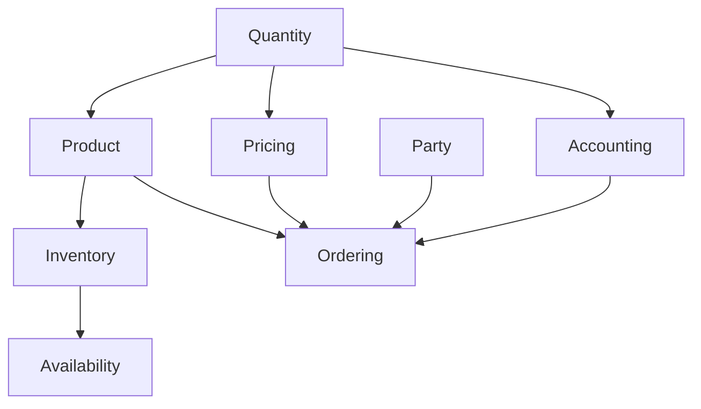

## What Are Software Archetypes?

Software archetypes are **recurring business patterns** that appear across different domains with similar structure and behavior. Rather than reinventing these concepts for each project, we can recognize them and apply proven implementations.

<Tip>
Think of archetypes as "business design patterns" - similar to how technical design patterns (Factory, Observer) solve recurring code problems, archetypes solve recurring domain modeling problems.
</Tip>

## The Archetype Catalog

Archetypy Oprogramowania implements 11 core archetypes:

### Foundation Archetypes

<AccordionGroup>
  <Accordion title="Quantity - Measurements with Meaning" icon="ruler">
    **Problem:** Representing measurements that have both magnitude and unit. Mixing incompatible units (adding meters to kilograms) should be impossible at compile time.
    
    **Solution:** Type-safe `Quantity` and `Money` value objects that encode units in the type system.
    
    **Example from source** (`quantity/src/main/java/com/softwarearchetypes/quantity/Quantity.java:13`):
    ```java
    public record Quantity(BigDecimal amount, Unit unit) {
        public Quantity add(Quantity other) {
            checkArgument(this.unit.equals(other.unit),
                "Cannot add quantities with different units: %s and %s",
                this.unit, other.unit);
            return new Quantity(this.amount.add(other.amount), this.unit);
        }
    }
    ```
    
    **Use Cases:**
    - Inventory quantities (100 kg, 500 liters)
    - Financial amounts with currency (1000 PLN, 250 EUR)
    - Physical measurements (25.5 m², 1000 kWh)
  </Accordion>

  <Accordion title="Accounting - Double-Entry Bookkeeping" icon="calculator">
    **Problem:** Tracking financial transactions with accountability, auditability, and temporal queries ("what was the balance on March 15?").
    
    **Solution:** Complete double-entry accounting system with accounts, entries, transactions, and temporal projections.
    
    **Core concepts:**
    - **Account:** A ledger tracking debits and credits
    - **Transaction:** A balanced set of entries (sum of debits = sum of credits)
    - **Entry:** Individual debit or credit to an account
    - **Validity:** Time ranges for entries (supports backdating, future-dated entries)
    
    **Example from source** (`accounting/src/main/java/com/softwarearchetypes/accounting/AccountingFacade.java:164`):
    ```java
    public Result<String, TransactionId> transfer(
        AccountId from, AccountId to, Money amount, 
        Instant occurredAt, Instant appliesAt) {
        
        Transaction transaction = transactionBuilderFactory.transaction()
            .occurredAt(occurredAt)
            .appliesAt(appliesAt)
            .withTypeOf("transfer")
            .executing()
            .debitFrom(from, amount)  // Remove from source
            .creditTo(to, amount)     // Add to destination
            .build();
            
        return execute(transaction);
    }
    ```
    
    **Use Cases:**
    - Financial ledgers and journals
    - Customer account balances
    - Revenue recognition
    - Audit trails
  </Accordion>

  <Accordion title="Party - People and Organizations" icon="users">
    **Problem:** Modeling people, organizations, and their relationships. The same person can be a customer, supplier, and employee in different contexts.
    
    **Solution:** Party/Role pattern where a Party (person or organization) plays multiple Roles over time.
    
    **Key concepts:**
    - **Party:** Person or Organization with identity
    - **Role:** Function played by a party (Customer, Supplier, Employee)
    - **Address:** Physical, email, or phone addresses with lifecycle management
    - **AddressFacade:** Manages address definitions, updates, and removals
    
    **Example structure:**
    ```java
    Party: "Acme Corporation"
    ├── Role: Customer (since 2024-01-15)
    ├── Role: Supplier (since 2024-03-20)
    └── Addresses:
        ├── Billing Address (active)
        ├── Shipping Address 1 (active)
        └── Old Address (retired 2024-06-01)
    ```
    
    **Use Cases:**
    - Customer relationship management
    - Supplier management
    - HR systems
    - Multi-party contracts
  </Accordion>
</AccordionGroup>

### Product & Catalog Archetypes

<AccordionGroup>
  <Accordion title="Product - Type and Instance" icon="box">
    **Problem:** Modeling product definitions ("iPhone 15 Pro") vs. actual instances ("iPhone with serial #ABC123").
    
    **Solution:** Separation between `ProductType` (definition) and `ProductInstance` (actual item).
    
    **Product tracking strategies:**
    - `INDIVIDUALLY_TRACKED`: Each item has unique serial number (electronics, vehicles)
    - `BATCH_TRACKED`: Items grouped by batch/lot (food, pharmaceuticals)
    - `BULK_TRACKED`: Fungible items counted by quantity (nails, sand)
    
    **Example from source** (`product/src/main/java/com/softwarearchetypes/product/ProductFacade.java:46`):
    ```java
    var productBuilder = new ProductBuilder(productId, name, description)
        .withMetadata(ProductMetadata.of(command.metadata()));
    
    var typeBuilder = productBuilder
        .asProductType(unit, trackingStrategy)
        .withMandatoryFeature(colorFeature)
        .withOptionalFeature(warrantyFeature);
    
    var productType = typeBuilder.build();
    ```
    
    **Product features with constraints:**
    ```java
    // Color must be one of allowed values
    AllowedValuesConstraint.of("Red", "Blue", "Black")
    
    // Weight must be in range
    NumericRangeConstraint.between(0.5, 5.0)
    
    // Serial must match pattern
    RegexConstraint.of("^[A-Z]{2}\\d{6}$")
    ```
    
    **Use Cases:**
    - Product catalogs
    - Inventory management
    - Manufacturing
    - E-commerce
  </Accordion>

  <Accordion title="Pricing - Complex Price Calculations" icon="tag">
    **Problem:** Pricing logic that varies by time, quantity, customer segment, and context. Prices need versioning and audit trails.
    
    **Solution:** Composable calculator system with interpretation patterns and component versioning.
    
    **Calculator types:**
    - `SIMPLE_FIXED`: Flat price (e.g., 100 PLN)
    - `STEP_FUNCTION`: Volume discounts (100 units @ 10 PLN, 101+ @ 9 PLN)
    - `DISCRETE_POINTS`: Price lookup table
    - `DAILY_INCREMENT`: Price changes daily
    - `COMPOSITE`: Combines multiple calculators
    - `PERCENTAGE`: Percentage-based (e.g., 10% markup)
    
    **Interpretation patterns:**
    ```java
    // TOTAL: Returns total price for quantity
    Money totalPrice = facade.calculateTotal("laptop-pricing", 
        Parameters.of("quantity", 5));
    
    // UNIT: Returns average price per unit
    Money unitPrice = facade.calculateUnitPrice("laptop-pricing", 
        Parameters.of("quantity", 5));
    
    // MARGINAL: Returns price of next unit
    Money marginalPrice = facade.calculateMarginal("laptop-pricing", 
        Parameters.of("quantity", 5));
    ```
    
    **Example from source** (`pricing/src/main/java/com/softwarearchetypes/pricing/PricingFacade.java:54`):
    ```java
    public Money calculateTotal(String calculatorName, Parameters params) {
        Calculator calc = calculatorRepository.findByName(calculatorName)
            .orElseThrow();
        
        // Auto-wrap if calculator doesn't return TOTAL
        Calculator totalCalc = switch (calc.interpretation()) {
            case TOTAL -> calc;  // Already returns total
            case UNIT -> UnitToTotalAdapter.wrap(calc);
            case MARGINAL -> MarginalToTotalAdapter.wrap(calc);
        };
        
        return totalCalc.calculate(params);
    }
    ```
    
    **Use Cases:**
    - Dynamic pricing
    - Volume discounts
    - Time-of-day pricing
    - Customer-specific pricing
  </Accordion>
</AccordionGroup>

### Operational Archetypes

<AccordionGroup>
  <Accordion title="Inventory - Stock and Availability" icon="warehouse">
    **Problem:** Tracking physical inventory, reservations, and availability across locations.
    
    **Solution:** Three-layer architecture separating entry management, instance tracking, and availability.
    
    **Architecture:**
    ```
    InventoryFacade
    ├── InventoryEntry (per ProductType)
    │   └── ProductInstances (serial/batch/bulk)
    ├── AvailabilityFacade
    │   └── Resources with reservations
    └── ReservationFacade
        └── Blockades (locks)
    ```
    
    **Example from source** (`inventory/src/main/java/com/softwarearchetypes/inventory/InventoryFacade.java:137`):
    ```java
    public Result<String, InstanceId> createInstance(CreateInstance cmd) {
        // Validate against product definition
        Result<String, Void> validation = productValidator.validate(
            cmd.productId(),
            entry.product().trackingStrategy(),
            cmd.features()
        );
        
        if (validation.failure()) {
            return Result.failure(validation.getFailure());
        }
        
        ProductInstance instance = new InstanceBuilder(id, cmd.productId())
            .withSerial(cmd.serialNumber())
            .withBatch(cmd.batchId())
            .withQuantity(cmd.quantity())
            .withFeatures(cmd.features())
            .build();
        
        return Result.success(instance.id());
    }
    ```
    
    **Use Cases:**
    - Warehouse management
    - Stock reservations
    - Availability to promise (ATP)
    - Multi-location inventory
  </Accordion>

  <Accordion title="Ordering - Purchase and Sales Orders" icon="cart-shopping">
    **Problem:** Managing the complete lifecycle of orders from creation through fulfillment.
    
    **Solution:** Order aggregate with line items, state management, and processing workflows.
    
    **Key concepts:**
    - **Order:** Container for line items with total calculation
    - **OrderLine:** Individual product + quantity + price
    - **State machine:** Draft → Confirmed → Fulfilled → Closed
    
    **Use Cases:**
    - E-commerce orders
    - Purchase orders
    - Sales orders
    - Order processing workflows
  </Accordion>

  <Accordion title="Plan vs Execution - Temporal Modeling" icon="chart-gantt">
    **Problem:** Comparing what was planned to happen versus what actually happened.
    
    **Solution:** Parallel timelines for planned activities and actual execution with deviation analysis.
    
    **Use Cases:**
    - Project management
    - Manufacturing schedules
    - Delivery planning vs actual
    - Resource allocation planning
  </Accordion>
</AccordionGroup>

### Infrastructure Archetypes

<AccordionGroup>
  <Accordion title="Graphs - Hierarchies and Relationships" icon="diagram-project">
    **Problem:** Representing hierarchical structures (bill of materials, org charts) and network relationships.
    
    **Solution:** Graph data structures with traversal algorithms.
    
    **Use Cases:**
    - Bill of materials (BOM)
    - Organization hierarchies
    - Product categories
    - Dependency graphs
  </Accordion>

  <Accordion title="Rules - Business Logic Engine" icon="gavel">
    **Problem:** Encoding complex business rules that change frequently without code changes.
    
    **Solution:** Rule engine with condition evaluation and action execution.
    
    **Use Cases:**
    - Pricing rules
    - Approval workflows
    - Validation rules
    - Decision tables
  </Accordion>
</AccordionGroup>

## Archetype Composition

These archetypes don't exist in isolation - they compose to model complex domains:



**Example: E-commerce Order Processing**

1. **Party:** Customer places order
2. **Product:** Validates product configuration and features
3. **Pricing:** Calculates line item and total prices
4. **Inventory:** Checks availability and reserves stock
5. **Ordering:** Creates order with line items
6. **Accounting:** Records revenue transaction

<Tip>
Start by identifying which archetypes match your domain needs, then compose them using the Facade interfaces.
</Tip>

## Next Steps

Now that you understand the business archetypes, learn about the technical design patterns that implement them:

<Card title="Design Patterns" icon="drafting-compass" href="/concepts/design-patterns">
  Explore the Result monad, Facade pattern, Builder pattern, and Event-driven architecture used throughout the codebase.
</Card>