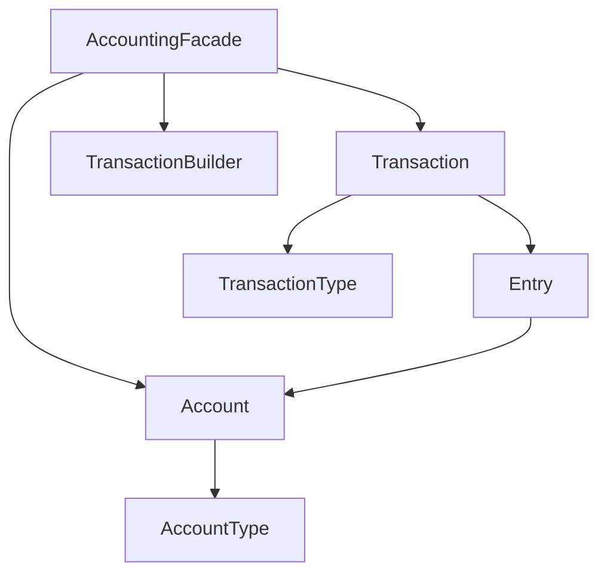

## Overview

The **Accounting** module implements a complete double-entry bookkeeping system. It provides accounts, transactions, entries, and temporal balance queries, following standard accounting principles.

## Core Concepts

### Architecture



### Account

Represents a financial account in the system:

```java Account Structure
class Account {
    private final AccountId accountId;
    private final AccountType type;
    private final AccountName name;
    private Money balance;
    private final Version version;  // Optimistic locking
    private final Entries newEntries;
}
```

**Account Types:**
- `ASSET` - Resources owned (increases with debit)
- `LIABILITY` - Obligations owed (increases with credit)
- `EQUITY` - Owner's capital (increases with credit)
- `REVENUE` - Income (increases with credit)
- `EXPENSE` - Costs (increases with debit)

### Transaction

A transaction groups multiple entries that must balance to zero:

```java Transaction Definition
public final class Transaction {
    private final TransactionId id;
    private final TransactionId refId;  // For reversals
    private final TransactionType type;
    private final Instant occurredAt;   // When it happened
    private final Instant appliesAt;    // When it takes effect
    private Map<Account, List<Entry>> entries;
}
```

<Note>
  **Double-entry constraint**: All debits must equal all credits. The sum of all entries in a transaction must be zero (for on-balance accounts).
</Note>

### Entry Types

```java Entry Hierarchy
sealed interface Entry {
    EntryId id();
    AccountId accountId();
    TransactionId transactionId();
    Money amount();
    Instant occurredAt();
    Instant appliesAt();
    Validity validity();
}

record AccountCredited(...) implements Entry {}
record AccountDebited(...) implements Entry {}
```

## AccountingFacade

The main entry point for all accounting operations:

### Creating Accounts

<CodeGroup>
```java Single Account
CreateAccount request = new CreateAccount(
    AccountId.random(),
    "ASSET",
    "Cash"
);

Result<String, AccountId> result = 
    accountingFacade.createAccount(request);

if (result.success()) {
    AccountId accountId = result.getSuccess();
}
```

```java Multiple Accounts
Set<CreateAccount> requests = Set.of(
    new CreateAccount(cashId, "ASSET", "Cash"),
    new CreateAccount(revenueId, "REVENUE", "Sales"),
    new CreateAccount(expenseId, "EXPENSE", "Costs")
);

Result<String, Set<AccountId>> result = 
    accountingFacade.createAccounts(requests);
```

```java With Initial Balances
AccountAmounts amounts = AccountAmounts.of(
    Map.of(
        cashId, Money.pln(10000),
        equityId, Money.pln(-10000)
    )
);

Result<String, Set<AccountId>> result = 
    accountingFacade.createAccountsWithInitialBalances(
        requests, 
        amounts
    );
```
</CodeGroup>

### Building Transactions

Use the `TransactionBuilder` for type-safe transaction construction:

```java Transfer Example
Transaction transaction = accountingFacade.transaction()
    .occurredAt(clock.instant())
    .appliesAt(clock.instant())
    .withTypeOf("transfer")
    .withMetadata(MetaData.of(Map.of("reference", "INV-001")))
    .executing()
        .debitFrom(fromAccount, Money.pln(1000))
        .creditTo(toAccount, Money.pln(1000))
    .build();

Result<String, TransactionId> result = 
    accountingFacade.execute(transaction);
```

### Common Operations

<AccordionGroup>
  <Accordion title="Simple Transfer">
    ```java
    Result<String, TransactionId> result = accountingFacade.transfer(
        fromAccountId,
        toAccountId,
        Money.pln(500),
        clock.instant(),
        clock.instant()
    );
    ```
  </Accordion>

  <Accordion title="Complex Transaction">
    ```java
    // Sale with tax
    Transaction sale = accountingFacade.transaction()
        .occurredAt(occurredAt)
        .appliesAt(appliesAt)
        .withTypeOf("sale")
        .executing()
            .debitFrom(cashId, Money.pln(123))      // Total received
            .creditTo(revenueId, Money.pln(100))    // Revenue
            .creditTo(taxId, Money.pln(23))         // VAT
        .build();
    
    accountingFacade.execute(sale);
    ```
  </Accordion>

  <Accordion title="Reversal Transaction">
    ```java
    // Reverse a previous transaction
    Transaction reversal = accountingFacade.transaction()
        .occurredAt(clock.instant())
        .appliesAt(clock.instant())
        .reverting(originalTransactionId)
        .build();
    
    accountingFacade.execute(reversal);
    ```
  </Accordion>

  <Accordion title="Using Commands">
    ```java
    ExecuteTransactionCommand command = new ExecuteTransactionCommand(
        clock.instant(),
        clock.instant(),
        "payment",
        Map.of("invoice", "INV-123"),
        List.of(
            new ExecuteTransactionCommand.Entry(
                DEBIT,
                expenseId.uuid(),
                Money.pln(1000),
                null,
                null
            ),
            new ExecuteTransactionCommand.Entry(
                CREDIT,
                cashId.uuid(),
                Money.pln(-1000),
                null,
                null
            )
        )
    );
    
    Result<String, TransactionId> result = 
        accountingFacade.handle(command);
    ```
  </Accordion>
</AccordionGroup>

## Temporal Queries

Query balances at any point in time:

```java Balance Queries
// Current balance
Optional<Money> currentBalance = 
    accountingFacade.balance(accountId);

// Historical balance
Instant pointInTime = Instant.parse("2024-01-15T00:00:00Z");
Optional<Money> historicalBalance = 
    accountingFacade.balanceAsOf(accountId, pointInTime);

// Multiple accounts
Set<AccountId> accountIds = Set.of(cash, revenue, expense);
Balances balances = accountingFacade.balances(accountIds);

// Historical balances for multiple accounts
Balances historicalBalances = 
    accountingFacade.balancesAsOf(accountIds, pointInTime);
```

### Validity Windows

Entries can have validity periods for temporal accounting:

```java Temporal Entries
Validity validity = Validity.between(
    LocalDateTime.of(2024, 1, 1, 0, 0),
    LocalDateTime.of(2024, 12, 31, 23, 59)
);

Transaction transaction = accountingFacade.transaction()
    .occurredAt(clock.instant())
    .appliesAt(clock.instant())
    .withTypeOf("annual_allocation")
    .executing()
        .debitFrom(accountId, Money.pln(12000), validity)
        .creditTo(otherId, Money.pln(12000), validity)
    .build();
```

## Projection Accounts

Create virtual accounts that project filtered views:

```java Projection Account
AccountEntryFilter filter = AccountEntryFilter.builder()
    .withType("sale")
    .forAccount(revenueId)
    .build();

Result<String, AccountId> result = 
    accountingFacade.createProjectingAccount(
        projectionId,
        filter,
        "Sales Revenue Only"
    );

// Query the projection
Optional<Money> salesRevenue = 
    accountingFacade.balance(projectionId);
```

## Transaction Constraints

Built-in validation ensures accounting integrity:

```java Constraints
interface TransactionEntriesConstraint {
    boolean test(Map<Entry, Account> entries);
    String errorMessage();
    
    // Built-in constraints:
    TransactionEntriesConstraint BALANCING_CONSTRAINT;
    TransactionEntriesConstraint MIN_2_ENTRIES_CONSTRAINT;
    TransactionEntriesConstraint MIN_2_ACCOUNTS_INVOLVED_CONSTRAINT;
}
```

<Warning>
  Transactions that violate these constraints will be rejected:
  - Sum of all entries must equal zero (for double-entry accounts)
  - At least 2 entries required
  - At least 2 different accounts must be involved
</Warning>

## Event Publishing

The module publishes domain events for all significant operations:

```java Accounting Events
// Events are automatically published
public sealed interface AccountingEvent extends PublishedEvent {
    // ...
}

record CreditEntryRegistered(
    UUID eventId,
    Instant occurredAt,
    Instant appliesAt,
    UUID entryId,
    UUID accountId,
    UUID transactionId,
    Money amount
) implements AccountingEvent {}

record DebitEntryRegistered(
    // Similar structure
) implements AccountingEvent {}
```

**Subscribe to events:**
```java
eventPublisher.register(event -> {
    if (event instanceof CreditEntryRegistered credited) {
        // Handle credit entry
        log.info("Credit: {} to account {}", 
                 credited.amount(), 
                 credited.accountId());
    }
});
```

## Querying

### Account Views

```java Account Queries
// Single account
Optional<AccountView> account = 
    accountingFacade.findAccount(accountId);

if (account.isPresent()) {
    AccountView view = account.get();
    Money balance = view.balance();
    List<EntryView> entries = view.entries();
}

// Multiple accounts
List<AccountView> accounts = 
    accountingFacade.findAccounts(Set.of(id1, id2, id3));

// All accounts
List<AccountView> allAccounts = 
    accountingFacade.findAll();
```

### Transaction Views

```java Transaction Queries
// Find transaction
Optional<TransactionView> tx = 
    accountingFacade.findTransactionBy(transactionId);

if (tx.isPresent()) {
    TransactionView view = tx.get();
    TransactionType type = view.type();
    Instant occurred = view.occurredAt();
    List<TransactionAccountEntriesView> entries = view.entries();
}

// Find all transactions for an account
List<TransactionId> transactionIds = 
    accountingFacade.findTransactionIdsFor(accountId);
```

## Best Practices

<CardGroup cols={2}>
  <Card title="Always Balance" icon="scale-balanced">
    Ensure debits equal credits in every transaction
  </Card>
  
  <Card title="Use MetaData" icon="tag">
    Store reference information in transaction metadata
  </Card>
  
  <Card title="Temporal Awareness" icon="clock">
    Distinguish between occurredAt (when) and appliesAt (effective)
  </Card>
  
  <Card title="Immutable History" icon="lock">
    Never modify entries - use reversal transactions instead
  </Card>
</CardGroup>

## Real-World Scenarios

### Invoice Payment

```java
// Customer pays invoice
Transaction payment = accountingFacade.transaction()
    .occurredAt(clock.instant())
    .appliesAt(clock.instant())
    .withTypeOf("invoice_payment")
    .withMetadata(MetaData.of(Map.of(
        "invoice", "INV-2024-001",
        "customer", "CUST-123"
    )))
    .executing()
        .debitFrom(cashId, Money.pln(1230))           // Cash received
        .creditTo(receivablesId, Money.pln(1230))     // Reduce receivables
    .build();
```

### Expense Recording

```java
// Record business expense
Transaction expense = accountingFacade.transaction()
    .occurredAt(clock.instant())
    .appliesAt(clock.instant())
    .withTypeOf("expense")
    .executing()
        .debitFrom(expenseId, Money.pln(500))         // Expense
        .creditTo(cashId, Money.pln(500))             // Pay from cash
    .build();
```

## Configuration

```java Accounting Setup
AccountingConfiguration config = new AccountingConfiguration();
AccountingFacade accountingFacade = config.accountingFacade(
    clock,
    eventPublisher
);
```

## Related Modules

- Uses [Common](/modules/common) for Result and events
- Uses [Quantity](/modules/quantity) for Money
- Can be integrated with [Ordering](/modules/ordering) for order accounting
- Can track [Inventory](/modules/inventory) valuations
