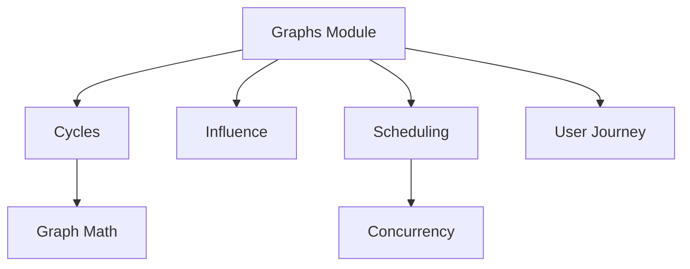

## Overview

The **Graphs** module provides graph-based algorithms and data structures for:
- Cycle detection in resource dependencies
- Batch reservation with conflict resolution
- Influence zone analysis
- Process scheduling with dependencies
- User journey modeling
- Concurrency analysis

## Module Structure



## Graph Math Foundation

Core graph data structures:

### Graph

```java Graph Class
public class Graph<T, P> {
    private final Map<Node<T>, List<Edge<T, P>>> adjacencyMatrix;
    
    public Graph<T, P> addEdge(Edge<T, P> edge);
    
    public Optional<Path<T, P>> findFirstCycle();
    
    public boolean hasEdge(Node<T> from, Node<T> to);
    
    public <P2> Graph<T, P> intersection(Graph<T, P2> other);
    
    public void removeEdge(Edge<T, P> edge);
}
```

### Node, Edge, Path

```java Graph Elements
public record Node<T>(T value) {
    public static <T> Node<T> of(T value) {
        return new Node<>(value);
    }
}

public record Edge<T, P>(
    Node<T> from,
    Node<T> to,
    P properties
) {
    public static <T, P> Edge<T, P> between(
        Node<T> from,
        Node<T> to,
        P properties
    ) {
        return new Edge<>(from, to, properties);
    }
}

public record Path<T, P>(
    List<Edge<T, P>> edges
) {
    public List<Node<T>> nodes() {
        if (edges.isEmpty()) {
            return List.of();
        }
        List<Node<T>> result = new ArrayList<>();
        result.add(edges.get(0).from());
        edges.forEach(edge -> result.add(edge.to()));
        return result;
    }
}
```

<Note>
  The Graph implementation is currently AI-generated and marked TODO for replacement with a proper graph library.
</Note>

## Cycles: Resource Reservation

Detect and resolve circular dependencies in resource reservations.

### Slot and Reservation

```java Slot
public class Slot {
    private final SlotId id;
    private final LocalDateTime start;
    private final LocalDateTime end;
    private final Set<Eligibility> eligibilities;
    private Optional<OwnerId> currentOwner;
    
    public boolean isAvailableFor(OwnerId owner) {
        if (currentOwner.isPresent()) {
            return false;
        }
        return eligibilities.stream()
            .anyMatch(e -> e.allows(owner));
    }
    
    public Result<String, Void> reserve(OwnerId owner) {
        if (!isAvailableFor(owner)) {
            return Result.failure("Slot not available");
        }
        currentOwner = Optional.of(owner);
        return Result.success(null);
    }
}

public record Eligibility(
    Set<OwnerId> allowedOwners
) {
    public boolean allows(OwnerId owner) {
        return allowedOwners.isEmpty() 
            || allowedOwners.contains(owner);
    }
}
```

### Batch Reservation

Reserve multiple slots while detecting circular dependencies:

```java BatchReservationUseCase
public class BatchReservationUseCase {
    private final SlotRepository slotRepository;
    
    public BatchReservationResult execute(
        List<ReservationChangeRequest> requests
    ) {
        // 1. Build dependency graph
        Graph<SlotId, ReservationChangeRequest> graph = 
            buildDependencyGraph(requests);
        
        // 2. Check for cycles
        Optional<Path<SlotId, ReservationChangeRequest>> cycle = 
            graph.findFirstCycle();
        
        if (cycle.isPresent()) {
            return BatchReservationResult.failure(
                "Circular dependency detected: " + 
                formatCycle(cycle.get())
            );
        }
        
        // 3. Process reservations in topological order
        List<SlotId> processed = new ArrayList<>();
        for (ReservationChangeRequest request : requests) {
            Result<String, Void> result = 
                processRequest(request);
            if (result.failure()) {
                // Rollback
                rollback(processed);
                return BatchReservationResult.failure(
                    result.getFailure()
                );
            }
            processed.add(request.slotId());
        }
        
        return BatchReservationResult.success(processed);
    }
}

// Reservation request
public record ReservationChangeRequest(
    SlotId slotId,
    OwnerId newOwner,
    Optional<OwnerId> previousOwner
) {}

// Result
public record BatchReservationResult(
    boolean success,
    List<SlotId> processedSlots,
    Optional<String> error
) {
    static BatchReservationResult success(List<SlotId> slots);
    static BatchReservationResult failure(String error);
}
```

### Usage Example

```java Batch Reservation
// Create slots
Slot slot1 = new Slot(
    SlotId.of("SLOT-1"),
    LocalDateTime.of(2024, 3, 15, 10, 0),
    LocalDateTime.of(2024, 3, 15, 11, 0),
    Set.of(Eligibility.allowAll())
);

Slot slot2 = new Slot(
    SlotId.of("SLOT-2"),
    LocalDateTime.of(2024, 3, 15, 11, 0),
    LocalDateTime.of(2024, 3, 15, 12, 0),
    Set.of(Eligibility.allowAll())
);

// Attempt batch reservation
List<ReservationChangeRequest> requests = List.of(
    new ReservationChangeRequest(
        SlotId.of("SLOT-1"),
        OwnerId.of("USER-A"),
        Optional.empty()
    ),
    new ReservationChangeRequest(
        SlotId.of("SLOT-2"),
        OwnerId.of("USER-A"),
        Optional.empty()
    )
);

BatchReservationResult result = 
    batchReservationUseCase.execute(requests);

if (result.success()) {
    // All slots reserved
} else {
    // Conflict or cycle detected
    System.out.println(result.error().get());
}
```

## Influence: Zone Analysis

Model influence zones and their interactions in physical/logical spaces.

### Influence Concepts

```java Influence Zone
public class InfluenceZone {
    private final InfluenceUnit source;
    private final Set<InfluenceUnit> affected;
    private final double radius;
    
    public boolean affects(InfluenceUnit unit) {
        return affected.contains(unit);
    }
    
    public Set<InfluenceUnit> getAffectedUnits() {
        return Set.copyOf(affected);
    }
}

public interface InfluenceUnit {
    String id();
    Position position();
}

// Example: Laboratory equipment
public record Laboratory(
    String id,
    Position position,
    EquipmentType type
) implements InfluenceUnit {}
```

### Influence Map

```java InfluenceMap
public class InfluenceMap {
    private final Map<InfluenceUnit, InfluenceZone> zones;
    
    public void addZone(InfluenceZone zone) {
        zones.put(zone.source(), zone);
    }
    
    public Set<InfluenceUnit> findConflicts(
        InfluenceUnit unit
    ) {
        return zones.values().stream()
            .filter(zone -> zone.affects(unit))
            .map(InfluenceZone::source)
            .collect(Collectors.toSet());
    }
    
    public Set<Reservation> findBridgingReservations(
        Reservation newReservation
    ) {
        // Find reservations that would create 
        // influence conflicts
        return existingReservations.stream()
            .filter(existing -> 
                wouldConflict(existing, newReservation))
            .collect(Collectors.toSet());
    }
}
```

### Physics and Infrastructure Influence

```java Influence Types
// Physics-based influence
public class PhysicsInfluence implements InfluenceZone {
    private final PhysicsProcess process;
    private final double temperature;
    private final double vibrationLevel;
    
    public boolean interferesWith(PhysicsProcess other) {
        // Check if processes interfere
        return temperature > other.maxTemperature()
            || vibrationLevel > other.maxVibration();
    }
}

// Infrastructure influence
public class InfrastructureInfluence implements InfluenceZone {
    private final Set<Laboratory> laboratories;
    private final LaboratoryAdjacency adjacency;
    
    public boolean canCoexist(Laboratory lab) {
        return laboratories.stream()
            .noneMatch(existing -> 
                adjacency.forbids(existing, lab));
    }
}
```

### Influence Analyzer

```java InfluenceAnalyzer
public class InfluanceAnalyzer {
    
    public AnalysisResult analyze(
        InfluenceMap map,
        List<Reservation> plannedReservations
    ) {
        List<Conflict> conflicts = new ArrayList<>();
        
        for (Reservation reservation : plannedReservations) {
            Set<InfluenceUnit> conflicting = 
                map.findConflicts(reservation.unit());
            
            if (!conflicting.isEmpty()) {
                conflicts.add(new Conflict(
                    reservation,
                    conflicting
                ));
            }
        }
        
        return new AnalysisResult(conflicts);
    }
}
```

## Scheduling: Process Dependencies

Schedule processes with dependencies and concurrency constraints.

### Process and Steps

```java Process Structure
public class Process {
    private final ProcessId id;
    private final List<ProcessStep> steps;
    private final Map<ProcessStep, Set<ProcessStep>> dependencies;
    
    public List<ProcessStep> getReadySteps(
        Set<ProcessStep> completed
    ) {
        return steps.stream()
            .filter(step -> !completed.contains(step))
            .filter(step -> {
                Set<ProcessStep> deps = 
                    dependencies.getOrDefault(step, Set.of());
                return completed.containsAll(deps);
            })
            .toList();
    }
}

public record ProcessStep(
    String id,
    Duration estimatedDuration,
    Set<ResourceRequirement> requiredResources
) {}

public enum DependencyType {
    FINISH_TO_START,    // B starts after A finishes
    START_TO_START,     // B starts when A starts
    FINISH_TO_FINISH,   // B finishes when A finishes
    START_TO_FINISH     // B finishes when A starts
}
```

### Schedule

```java Schedule
public class Schedule {
    private final Map<ProcessStep, Instant> startTimes;
    private final Map<ProcessStep, Instant> endTimes;
    
    public void scheduleStep(
        ProcessStep step,
        Instant start
    ) {
        startTimes.put(step, start);
        endTimes.put(
            step,
            start.plus(step.estimatedDuration())
        );
    }
    
    public boolean hasOverlap(
        ProcessStep step1,
        ProcessStep step2
    ) {
        Instant start1 = startTimes.get(step1);
        Instant end1 = endTimes.get(step1);
        Instant start2 = startTimes.get(step2);
        Instant end2 = endTimes.get(step2);
        
        return start1.isBefore(end2) && start2.isBefore(end1);
    }
    
    public Duration totalDuration() {
        if (endTimes.isEmpty()) {
            return Duration.ZERO;
        }
        Instant earliest = startTimes.values().stream()
            .min(Instant::compareTo)
            .orElseThrow();
        Instant latest = endTimes.values().stream()
            .max(Instant::compareTo)
            .orElseThrow();
        return Duration.between(earliest, latest);
    }
}
```

### Concurrency Analysis

```java Concurrency
public class Concurrency {
    
    public static int maxConcurrentSteps(
        Schedule schedule
    ) {
        // Find maximum number of overlapping steps
        List<Instant> events = new ArrayList<>();
        schedule.startTimes().forEach((step, time) -> {
            events.add(time);  // +1
        });
        schedule.endTimes().forEach((step, time) -> {
            events.add(time);  // -1
        });
        
        events.sort(Instant::compareTo);
        
        int max = 0;
        int current = 0;
        for (Instant event : events) {
            if (isStart(event, schedule)) {
                current++;
                max = Math.max(max, current);
            } else {
                current--;
            }
        }
        
        return max;
    }
}

// Execution environments
public record ExecutionEnvironments(
    Map<String, Integer> capacities
) {
    public boolean canHandle(
        int concurrentProcesses,
        String environmentType
    ) {
        return capacities.getOrDefault(environmentType, 0) 
            >= concurrentProcesses;
    }
}
```

## User Journey

Model user flows and state transitions.

### Condition-based Flow

```java User Journey
public class UserJourney {
    private final Map<State, List<Transition>> transitions;
    
    public record State(String id, String description) {}
    
    public record Transition(
        State from,
        State to,
        Condition condition,
        Action action
    ) {}
    
    public interface Condition {
        boolean isMet(UserContext context);
    }
    
    public interface Action {
        void execute(UserContext context);
    }
    
    public List<State> possibleNextStates(
        State current,
        UserContext context
    ) {
        return transitions.getOrDefault(current, List.of())
            .stream()
            .filter(t -> t.condition().isMet(context))
            .map(Transition::to)
            .toList();
    }
}
```

### Example: Checkout Flow

```java Checkout Journey
UserJourney checkout = new UserJourney();

State cart = new State("cart", "Shopping Cart");
State shipping = new State("shipping", "Shipping Info");
State payment = new State("payment", "Payment");
State confirmation = new State("confirmation", "Order Confirmed");

// Cart -> Shipping (if items in cart)
checkout.addTransition(new Transition(
    cart,
    shipping,
    ctx -> !ctx.cart().isEmpty(),
    ctx -> ctx.saveCart()
));

// Shipping -> Payment (if address valid)
checkout.addTransition(new Transition(
    shipping,
    payment,
    ctx -> ctx.shippingAddress().isValid(),
    ctx -> ctx.calculateShipping()
));

// Payment -> Confirmation (if payment successful)
checkout.addTransition(new Transition(
    payment,
    confirmation,
    ctx -> ctx.payment().isSuccessful(),
    ctx -> ctx.createOrder()
));
```

## Real-World Example: Laboratory Scheduling

```java Laboratory Scheduling
// 1. Define laboratories with positions
Laboratory cleanRoom = new Laboratory(
    "LAB-CLEAN-01",
    Position.of(0, 0),
    EquipmentType.CLEAN_ROOM
);

Laboratory chemLab = new Laboratory(
    "LAB-CHEM-01",
    Position.of(0, 10),  // 10 meters away
    EquipmentType.CHEMISTRY
);

// 2. Define influence zones
InfluenceZone cleanRoomZone = new InfluenceZone(
    cleanRoom,
    Set.of(chemLab),  // Chemistry lab affects clean room
    20.0  // 20 meter radius
);

InfluenceMap map = new InfluenceMap();
map.addZone(cleanRoomZone);

// 3. Plan reservations
Reservation cleanRoomReservation = new Reservation(
    cleanRoom,
    LocalDateTime.of(2024, 3, 15, 10, 0),
    LocalDateTime.of(2024, 3, 15, 12, 0),
    OwnerId.of("RESEARCHER-A")
);

Reservation chemLabReservation = new Reservation(
    chemLab,
    LocalDateTime.of(2024, 3, 15, 10, 30),
    LocalDateTime.of(2024, 3, 15, 11, 30),
    OwnerId.of("RESEARCHER-B")
);

// 4. Check for conflicts
Set<Reservation> conflicts = 
    map.findBridgingReservations(chemLabReservation);

if (!conflicts.isEmpty()) {
    // Reschedule chemistry lab work
    chemLabReservation = chemLabReservation.reschedule(
        LocalDateTime.of(2024, 3, 15, 13, 0),
        LocalDateTime.of(2024, 3, 15, 14, 0)
    );
}
```

## Best Practices

<CardGroup cols={2}>
  <Card title="Detect Cycles" icon="rotate">
    Always check for circular dependencies before committing
  </Card>
  
  <Card title="Topological Sort" icon="sort">
    Process dependencies in correct order
  </Card>
  
  <Card title="Rollback Ready" icon="rotate-left">
    Design operations to be reversible
  </Card>
  
  <Card title="Test Concurrency" icon="users">
    Verify concurrent execution limits
  </Card>
</CardGroup>

## Related Modules

- Uses [Common](/modules/common) for Result pattern
- Can integrate with [Inventory](/modules/inventory) for resource allocation
- Can integrate with [Party](/modules/party) for capability-based scheduling
