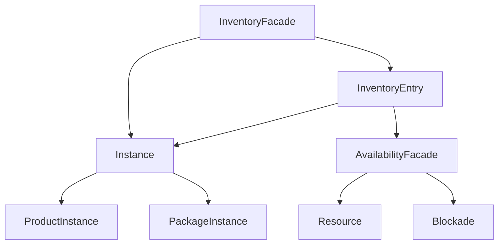

## Overview

The **Inventory** module manages physical and logical inventory, providing:
- Inventory entries per product
- Product instances (serialized, batched)
- Availability management and blockades
- Resource allocation
- Instance-to-resource mapping
- Counting and filtering

## Architecture



## Core Components

### InventoryEntry

Central registry for a product's inventory:

```java InventoryEntry
public class InventoryEntry {
    private final InventoryEntryId id;
    private final InventoryProduct product;
    private final Set<InstanceId> instances;
    private final Map<InstanceId, ResourceId> instanceToResource;
    
    public void addInstance(Instance instance);
    public void removeInstance(InstanceId instanceId);
    public void mapInstanceToResource(
        InstanceId instanceId,
        ResourceId resourceId
    );
    public List<ResourceId> resourceIds();
}
```

**Inventory Product:**
```java
record InventoryProduct(
    ProductIdentifier productId,
    ProductTrackingStrategy trackingStrategy,
    Unit preferredUnit
) {}
```

### Instance

Physical or logical product instances:

```java Instance Types
sealed interface Instance permits ProductInstance, PackageInstance {
    InstanceId id();
    ProductIdentifier productId();
    Optional<SerialNumber> serialNumber();
    Optional<BatchId> batchId();
    Quantity effectiveQuantity();
}

// Individual instance
record ProductInstance(
    InstanceId id,
    ProductIdentifier productId,
    SerialNumber serialNumber,
    BatchId batchId,
    Quantity quantity,
    Map<String, Object> features
) implements Instance {
    
    @Override
    public Quantity effectiveQuantity() {
        return quantity;
    }
}
```

## InventoryFacade

Main entry point for inventory operations:

### Creating Inventory Entries

```java Creating Entries
CreateInventoryEntry command = new CreateInventoryEntry(
    new InventoryProduct(
        ProductIdentifier.of("PROD-001"),
        ProductTrackingStrategy.SERIAL_NUMBER,
        Unit.pieces()
    )
);

Result<String, InventoryEntryId> result = 
    inventoryFacade.handle(command);

if (result.success()) {
    InventoryEntryId entryId = result.getSuccess();
}
```

### Creating Instances

<CodeGroup>
```java Serial Number Tracking
CreateInstance command = new CreateInstance(
    ProductIdentifier.of("LAPTOP-001"),
    Optional.of(TextualSerialNumber.of("SN123456")),
    Optional.empty(),
    Quantity.of(1, Unit.pieces()),
    Map.of(
        "model", "Pro 15",
        "color", "Silver"
    )
);

Result<String, InstanceId> result = 
    inventoryFacade.createInstance(command);
```

```java Batch Tracking
CreateInstance command = new CreateInstance(
    ProductIdentifier.of("MEDICATION-001"),
    Optional.empty(),
    Optional.of(BatchId.of("BATCH-2024-03")),
    Quantity.of(1000, Unit.of("units", "units")),
    Map.of(
        "expiryDate", LocalDate.of(2025, 12, 31),
        "manufacturer", "PharmaCo"
    )
);

Result<String, InstanceId> result = 
    inventoryFacade.createInstance(command);
```

```java Bulk Items (No Tracking)
CreateInstance command = new CreateInstance(
    ProductIdentifier.of("SAND-BULK"),
    Optional.empty(),
    Optional.empty(),
    Quantity.of(5000, Unit.of("kg", "kilogram")),
    Map.of()
);

Result<String, InstanceId> result = 
    inventoryFacade.createInstance(command);
```
</CodeGroup>

## Counting and Filtering

### Instance Criteria

Filter instances based on criteria:

```java InstanceCriteria
public class InstanceCriteria {
    
    public static InstanceCriteria any() {
        return new InstanceCriteria(instance -> true);
    }
    
    public static InstanceCriteria withBatch(BatchId batchId) {
        return new InstanceCriteria(
            instance -> instance.batchId()
                .map(b -> b.equals(batchId))
                .orElse(false)
        );
    }
    
    public static InstanceCriteria withFeature(
        String featureName,
        Object expectedValue
    ) {
        return new InstanceCriteria(
            instance -> {
                if (instance instanceof ProductInstance pi) {
                    return expectedValue.equals(
                        pi.features().get(featureName)
                    );
                }
                return false;
            }
        );
    }
    
    public boolean isSatisfiedBy(Instance instance);
}
```

### Counting Products

```java Counting Examples
// Count all instances
Quantity total = inventoryFacade.countProduct(
    ProductIdentifier.of("PROD-001")
);

// Count specific batch
Quantity batchQty = inventoryFacade.countProduct(
    ProductIdentifier.of("MEDICATION-001"),
    InstanceCriteria.withBatch(BatchId.of("BATCH-2024-03"))
);

// Count by feature
Quantity blueItems = inventoryFacade.countProduct(
    productId,
    InstanceCriteria.withFeature("color", "Blue")
);

// Complex criteria
InstanceCriteria criteria = new InstanceCriteria(
    instance -> {
        if (instance instanceof ProductInstance pi) {
            LocalDate expiry = (LocalDate) pi.features().get("expiryDate");
            return expiry.isAfter(LocalDate.now().plusMonths(6));
        }
        return false;
    }
);

Quantity validStock = inventoryFacade.countProduct(productId, criteria);
```

### Finding Instances

```java Finding Instances
// Find by criteria
Set<InstanceId> instances = inventoryFacade.findInstances(
    productId,
    InstanceCriteria.withFeature("size", "Large")
);

// Find specific instance
Optional<InstanceView> instance = 
    inventoryFacade.findInstance(instanceId);

// Find by serial number
Optional<InstanceView> bySerial = 
    inventoryFacade.findInstanceBySerial(
        TextualSerialNumber.of("SN123456")
    );

// Find all in batch
List<InstanceView> batchInstances = 
    inventoryFacade.findInstancesByBatch(
        BatchId.of("BATCH-2024-03")
    );

// Find all for product
List<InstanceView> productInstances = 
    inventoryFacade.findInstancesByProduct(productId);
```

## Availability Management

The module delegates availability to `AvailabilityFacade`:

### Resources

Resources represent allocatable inventory:

```java Resource
public class Resource {
    private final ResourceId id;
    private final Quantity totalQuantity;
    private final Set<Blockade> blockades;
    
    public Quantity availableQuantity() {
        Quantity blocked = blockades.stream()
            .map(Blockade::quantity)
            .reduce(Quantity.zero(), Quantity::add);
        return totalQuantity.subtract(blocked);
    }
}
```

### Blockades

Temporary reservations of resources:

```java Blockade
public record Blockade(
    BlockadeId id,
    ResourceId resourceId,
    Quantity quantity,
    BlockadeReason reason,
    Validity validity,
    OwnerId owner
) {
    
    public boolean isActiveAt(Instant when) {
        return validity.isValidAt(when);
    }
}

public enum BlockadeReason {
    RESERVATION,      // Customer reservation
    QUALITY_CHECK,    // Under inspection
    MAINTENANCE,      // Maintenance hold
    DAMAGE,          // Damaged goods
    ALLOCATION       // Allocated to order
}
```

### Locking Inventory

```java Lock Operations
// Lock for order
LockCommand lockCmd = new LockCommand(
    ProductIdentifier.of("PROD-001"),
    Quantity.of(10, Unit.pieces()),
    BlockadeReason.ALLOCATION,
    OrderId.of("ORD-123"),
    Validity.forDays(7)
);

Result<String, List<BlockadeId>> result = 
    inventoryFacade.handle(lockCmd);

if (result.success()) {
    List<BlockadeId> blockades = result.getSuccess();
    // Inventory locked successfully
}
```

## Resource Mapping

Map instances to availability resources:

```java Instance-Resource Mapping
// Create resource
ResourceId resourceId = availabilityFacade.createResource(
    Quantity.of(100, Unit.pieces())
);

// Map instance to resource
Result<String, InventoryEntryId> result = 
    inventoryFacade.mapInstanceToResource(
        entryId,
        instanceId,
        resourceId
    );

// Find resources for product
List<ResourceId> resources = 
    inventoryFacade.findResourcesForProduct(productId);
```

## Querying

### Inventory Entry Views

```java Entry Queries
// Find entry
Optional<InventoryEntryView> entry = 
    inventoryFacade.findEntry(entryId);

// Find by product
Optional<InventoryEntryView> byProduct = 
    inventoryFacade.findEntryByProduct(productId);

// All entries
List<InventoryEntryView> allEntries = 
    inventoryFacade.findAllEntries();

// View structure
record InventoryEntryView(
    InventoryEntryId id,
    ProductIdentifier productId,
    ProductTrackingStrategy trackingStrategy,
    int instanceCount,
    List<ResourceId> mappedResources
) {}
```

### Instance Views

```java Instance Views
record InstanceView(
    InstanceId id,
    ProductIdentifier productId,
    Optional<String> serialNumber,
    Optional<String> batchId,
    Quantity quantity,
    Map<String, Object> features
) {
    static InstanceView from(Instance instance);
}
```

## Product Definition Validation

Validate instances against product definitions:

```java Validation
public interface ProductDefinitionValidator {
    
    Result<String, Void> validate(
        ProductIdentifier productId,
        ProductTrackingStrategy trackingStrategy,
        Map<String, Object> features
    );
}

// Example validator
public class StrictValidator 
    implements ProductDefinitionValidator {
    
    @Override
    public Result<String, Void> validate(
        ProductIdentifier productId,
        ProductTrackingStrategy trackingStrategy,
        Map<String, Object> features
    ) {
        // Validate against product catalog
        if (trackingStrategy == ProductTrackingStrategy.SERIAL_NUMBER
            && !features.containsKey("serialNumber")) {
            return Result.failure(
                "Serial number required for tracked products"
            );
        }
        return Result.success(null);
    }
}
```

## Real-World Example: Warehouse Operations

```java Complete Warehouse Flow
// 1. Receive shipment
CreateInventoryEntry createEntry = new CreateInventoryEntry(
    new InventoryProduct(
        ProductIdentifier.of("LAPTOP-PRO15"),
        ProductTrackingStrategy.SERIAL_NUMBER,
        Unit.pieces()
    )
);

Result<String, InventoryEntryId> entryResult = 
    inventoryFacade.handle(createEntry);

InventoryEntryId entryId = entryResult.getSuccess();

// 2. Register individual laptops
for (String serial : shipmentSerials) {
    CreateInstance createInstance = new CreateInstance(
        ProductIdentifier.of("LAPTOP-PRO15"),
        Optional.of(TextualSerialNumber.of(serial)),
        Optional.of(BatchId.of("SHIPMENT-2024-03-15")),
        Quantity.of(1, Unit.pieces()),
        Map.of(
            "model", "Pro 15",
            "color", "Silver",
            "receivedDate", LocalDate.now()
        )
    );
    
    inventoryFacade.createInstance(createInstance);
}

// 3. Check available stock
Quantity available = inventoryFacade.countProduct(
    ProductIdentifier.of("LAPTOP-PRO15")
);
// Result: 50 pieces

// 4. Customer orders 10 laptops
LockCommand lock = new LockCommand(
    ProductIdentifier.of("LAPTOP-PRO15"),
    Quantity.of(10, Unit.pieces()),
    BlockadeReason.ALLOCATION,
    OrderId.of("ORD-2024-001"),
    Validity.forDays(7)  // Hold for 7 days
);

Result<String, List<BlockadeId>> lockResult = 
    inventoryFacade.handle(lock);

// 5. Check remaining available
Quantity nowAvailable = inventoryFacade.countProduct(
    ProductIdentifier.of("LAPTOP-PRO15")
);
// Still 50 pieces (blockades don't reduce count)
// But availabilityFacade shows 40 available

// 6. Find specific units to ship
Set<InstanceId> toShip = inventoryFacade.findInstances(
    ProductIdentifier.of("LAPTOP-PRO15"),
    InstanceCriteria.withFeature("color", "Silver")
).stream().limit(10).collect(Collectors.toSet());

// 7. Mark as shipped (remove from inventory)
for (InstanceId instanceId : toShip) {
    inventoryFacade.removeInstanceFromEntry(entryId, instanceId);
}
```

## Expiry Management

```java Expiry Tracking
// Find expiring stock
LocalDate expiryThreshold = LocalDate.now().plusMonths(3);

InstanceCriteria expiringSoon = new InstanceCriteria(
    instance -> {
        if (instance instanceof ProductInstance pi) {
            Object expiry = pi.features().get("expiryDate");
            if (expiry instanceof LocalDate expiryDate) {
                return expiryDate.isBefore(expiryThreshold);
            }
        }
        return false;
    }
);

Set<InstanceId> expiringInstances = 
    inventoryFacade.findInstances(productId, expiringSoon);

// Lock expiring stock for clearance sale
for (InstanceId instanceId : expiringInstances) {
    LockCommand lock = new LockCommand(
        productId,
        Quantity.of(1, Unit.pieces()),
        BlockadeReason.ALLOCATION,
        PromoId.of("CLEARANCE-SALE"),
        Validity.forDays(30)
    );
    inventoryFacade.handle(lock);
}
```

## Best Practices

<CardGroup cols={2}>
  <Card title="Choose Tracking" icon="radar">
    Select appropriate tracking strategy per product
  </Card>
  
  <Card title="Use Criteria" icon="filter">
    Create reusable InstanceCriteria for common queries
  </Card>
  
  <Card title="Map Resources" icon="map">
    Link instances to availability resources
  </Card>
  
  <Card title="Validate Features" icon="check-double">
    Always validate instance features against product definition
  </Card>
</CardGroup>

## Configuration

```java
InventoryConfiguration config = new InventoryConfiguration();
InventoryFacade inventoryFacade = config.inventoryFacade(
    productValidator,
    availabilityFacade
);
```

## Related Modules

- Uses [Common](/modules/common) for Result pattern
- Uses [Quantity](/modules/quantity) for quantities
- Uses [Product](/modules/product) for product definitions
- Integrates with [Ordering](/modules/ordering) for order fulfillment
- Can track [Accounting](/modules/accounting) inventory valuations
