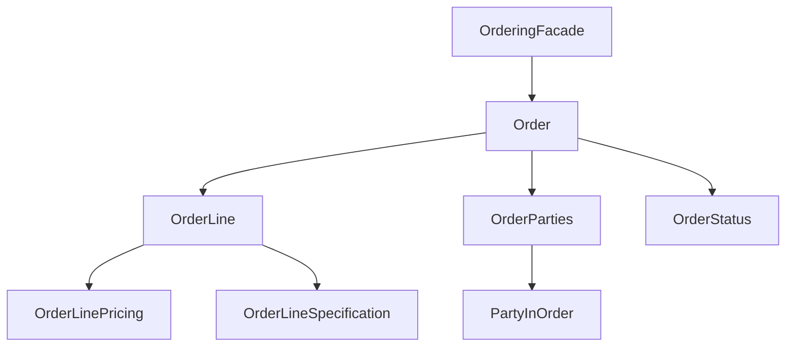

## Overview

The **Ordering** module implements a complete order management system supporting:
- Order creation and modification
- Order lines with quantities and specifications
- Party roles in orders (customer, supplier, etc.)
- Order pricing and arbitrary price adjustments
- Order lifecycle (draft, confirmed, fulfilled, cancelled)
- Fulfillment status tracking

## Architecture



## Order Structure

### Order

Main aggregate representing a customer order:

```java Order
public class Order {
    private final OrderId id;
    private final OrderParties parties;
    private final List<OrderLine> lines;
    private OrderStatus status;
    private FulfillmentStatus fulfillmentStatus;
    private final Instant createdAt;
    
    public void addLine(OrderLine line);
    public void removeLine(OrderLineId lineId);
    public void changeLineQuantity(OrderLineId lineId, Quantity newQty);
    public void priceLines();
    public void confirm();
    public void cancel();
}
```

### Order Status

```java Status Lifecycle
public enum OrderStatus {
    DRAFT,          // Being created/modified
    CONFIRMED,      // Customer confirmed
    PROCESSING,     // Being processed
    FULFILLED,      // Completed
    CANCELLED       // Cancelled
}
```

### Order Line

Individual item in an order:

```java OrderLine
public record OrderLine(
    OrderLineId id,
    ProductIdentifier productId,
    Quantity quantity,
    OrderLineSpecification specification,
    OrderLinePricing pricing
) {
    
    public Money totalPrice() {
        if (pricing == null) {
            return Money.zeroPln();
        }
        return pricing.totalPrice();
    }
}
```

## OrderingFacade

Main entry point for order operations:

### Creating Orders

```java Create Order
CreateOrderCommand command = new CreateOrderCommand(
    List.of(
        // Order parties
        new CreateOrderCommand.OrderPartyData(
            "CUST-123",
            "John Doe",
            "john@email.com",
            Set.of("CUSTOMER", "BILL_TO")
        ),
        new CreateOrderCommand.OrderPartyData(
            "SHOP-001",
            "Main Store",
            "store@shop.com",
            Set.of("SUPPLIER")
        )
    ),
    List.of(
        // Order lines
        new CreateOrderCommand.OrderLineData(
            "PROD-001",
            5,
            "pieces",
            Map.of("color", "Blue", "size", "M"),
            List.of()  // Line-level parties (optional)
        ),
        new CreateOrderCommand.OrderLineData(
            "PROD-002",
            2,
            "pieces",
            Map.of(),
            List.of()
        )
    )
);

Result<String, OrderView> result = 
    orderingFacade.handle(command);

if (result.success()) {
    OrderView order = result.getSuccess();
}
```

### Modifying Orders

<AccordionGroup>
  <Accordion title="Add Order Line">
    ```java
    AddOrderLineCommand command = new AddOrderLineCommand(
        OrderId.of("ORD-123"),
        "PROD-003",
        3,
        "pieces",
        Map.of("color", "Red"),
        List.of()
    );
    
    Result<String, OrderView> result = 
        orderingFacade.handle(command);
    ```
  </Accordion>

  <Accordion title="Remove Order Line">
    ```java
    RemoveOrderLineCommand command = new RemoveOrderLineCommand(
        OrderId.of("ORD-123"),
        OrderLineId.of("LINE-002")
    );
    
    Result<String, OrderView> result = 
        orderingFacade.handle(command);
    ```
  </Accordion>

  <Accordion title="Change Quantity">
    ```java
    ChangeOrderLineQuantityCommand command = 
        new ChangeOrderLineQuantityCommand(
            OrderId.of("ORD-123"),
            OrderLineId.of("LINE-001"),
            10,  // New quantity
            "pieces"
        );
    
    Result<String, OrderView> result = 
        orderingFacade.handle(command);
    ```
  </Accordion>

  <Accordion title="Set Arbitrary Price">
    ```java
    SetArbitraryLinePriceCommand command = 
        new SetArbitraryLinePriceCommand(
            OrderId.of("ORD-123"),
            OrderLineId.of("LINE-001"),
            new BigDecimal("99.99"),    // Unit price
            new BigDecimal("499.95"),   // Total price
            "PLN",
            "Special discount for VIP customer"
        );
    
    Result<String, OrderView> result = 
        orderingFacade.handle(command);
    ```
  </Accordion>
</AccordionGroup>

### Order Lifecycle

```java Lifecycle Operations
// Price order lines
PriceOrderCommand priceCmd = new PriceOrderCommand(
    OrderId.of("ORD-123")
);
orderingFacade.handle(priceCmd);

// Confirm order
ConfirmOrderCommand confirmCmd = new ConfirmOrderCommand(
    OrderId.of("ORD-123")
);
Result<String, OrderView> confirmed = 
    orderingFacade.handle(confirmCmd);

// Cancel order
CancelOrderCommand cancelCmd = new CancelOrderCommand(
    OrderId.of("ORD-123")
);
Result<String, OrderView> cancelled = 
    orderingFacade.handle(cancelCmd);
```

## Parties in Orders

### Party Roles

```java RoleInOrder
public enum RoleInOrder {
    CUSTOMER,       // Buying party
    SUPPLIER,       // Selling party
    BILL_TO,        // Billing address party
    SHIP_TO,        // Shipping address party
    BROKER,         // Intermediary
    CARRIER,        // Shipping carrier
    PAYER           // Paying party (may differ from customer)
}
```

### Party in Order

Snapshot of party information at order time:

```java PartyInOrder
public record PartyInOrder(
    PartySnapshot snapshot,
    Set<RoleInOrder> roles
) {
    
    public static PartyInOrder of(
        PartySnapshot snapshot,
        Set<RoleInOrder> roles
    ) {
        return new PartyInOrder(snapshot, roles);
    }
    
    public boolean hasRole(RoleInOrder role) {
        return roles.contains(role);
    }
}

// Party snapshot
public record PartySnapshot(
    PartyId partyId,
    String name,
    String contactInfo
) {
    static PartySnapshot of(
        PartyId partyId,
        String name,
        String contactInfo
    );
}
```

### Order Parties

Manages all parties involved in an order:

```java OrderParties
public class OrderParties {
    private final List<PartyInOrder> parties;
    private final OrderLevelRolePolicy rolePolicy;
    
    public static OrderParties forOrder(
        List<PartyInOrder> parties
    ) {
        return new OrderParties(
            parties,
            new OrderLevelRolePolicy()
        );
    }
    
    public Optional<PartyInOrder> findByRole(RoleInOrder role) {
        return parties.stream()
            .filter(p -> p.hasRole(role))
            .findFirst();
    }
    
    public List<PartyInOrder> all() {
        return List.copyOf(parties);
    }
}
```

## Order Line Specification

Additional specifications for order lines:

```java OrderLineSpecification
public record OrderLineSpecification(
    Map<String, Object> specifications
) {
    
    public static OrderLineSpecification empty() {
        return new OrderLineSpecification(Map.of());
    }
    
    public static OrderLineSpecification of(
        Map<String, Object> specs
    ) {
        return new OrderLineSpecification(specs);
    }
    
    public Object get(String key) {
        return specifications.get(key);
    }
}

// Usage
OrderLineSpecification spec = OrderLineSpecification.of(
    Map.of(
        "color", "Navy Blue",
        "size", "XL",
        "customText", "Happy Birthday!",
        "giftWrap", true
    )
);
```

## Order Line Pricing

Pricing information for order lines:

```java OrderLinePricing
public record OrderLinePricing(
    Money unitPrice,
    Money totalPrice,
    Optional<String> priceOverrideReason
) {
    
    public static OrderLinePricing of(
        Money unitPrice,
        Money totalPrice
    ) {
        return new OrderLinePricing(
            unitPrice,
            totalPrice,
            Optional.empty()
        );
    }
    
    public static OrderLinePricing withOverride(
        Money unitPrice,
        Money totalPrice,
        String reason
    ) {
        return new OrderLinePricing(
            unitPrice,
            totalPrice,
            Optional.of(reason)
        );
    }
    
    public boolean isOverridden() {
        return priceOverrideReason.isPresent();
    }
}
```

## Fulfillment

Tracking order fulfillment:

```java FulfillmentStatus
public enum FulfillmentStatus {
    PENDING,        // Not started
    PICKING,        // Items being picked
    PACKING,        // Being packed
    SHIPPED,        // Shipped to customer
    DELIVERED,      // Delivered
    RETURNED        // Returned by customer
}

// Update fulfillment
FulfillmentUpdated event = new FulfillmentUpdated(
    OrderId.of("ORD-123"),
    FulfillmentStatus.SHIPPED,
    Instant.now(),
    Optional.of("Tracking: 1Z999AA10123456784")
);

Result<String, OrderView> result = 
    orderingFacade.handle(event);
```

## Order Builder Pattern

Fluent API for building orders:

```java Order Building
Order.Builder builder = orderFactory.newOrder(
    OrderId.generate(),
    orderParties
);

Order order = builder
    .addLine(line -> line
        .productId(ProductIdentifier.of("PROD-001"))
        .quantity(Quantity.of(5, Unit.pieces()))
        .specification(OrderLineSpecification.of(
            Map.of("color", "Blue")
        ))
    )
    .addLine(line -> line
        .productId(ProductIdentifier.of("PROD-002"))
        .quantity(Quantity.of(2, Unit.pieces()))
        .parties(lineParties)
    )
    .build();
```

## Order Services

Integration with external services:

```java Order Services
public record OrderServices(
    PricingService pricingService,
    InventoryService inventoryService,
    PaymentService paymentService,
    FulfillmentService fulfillmentService,
    BillingService billingService
) {
    // Services injected into Order aggregate
}

// Service interfaces
public interface PricingService {
    Money calculatePrice(
        ProductIdentifier productId,
        Quantity quantity
    );
}

public interface InventoryService {
    boolean isAvailable(
        ProductIdentifier productId,
        Quantity quantity
    );
    
    Result<String, List<BlockadeId>> reserve(
        ProductIdentifier productId,
        Quantity quantity,
        OrderId orderId
    );
}
```

## Order Events

Domain events published by orders:

```java Order Events
record OrderConfirmedEvent(
    OrderId orderId,
    Instant confirmedAt,
    Money totalAmount,
    List<OrderLineView> lines
) implements PublishedEvent {}

record FulfillmentUpdated(
    OrderId orderId,
    FulfillmentStatus status,
    Instant updatedAt,
    Optional<String> trackingInfo
) implements PublishedEvent {}
```

## Real-World Example: E-commerce Order

```java Complete Order Flow
// 1. Create order
CreateOrderCommand createCmd = new CreateOrderCommand(
    List.of(
        new CreateOrderCommand.OrderPartyData(
            "CUST-456",
            "Jane Smith",
            "jane@email.com",
            Set.of("CUSTOMER", "BILL_TO", "SHIP_TO")
        )
    ),
    List.of(
        new CreateOrderCommand.OrderLineData(
            "LAPTOP-001",
            1,
            "pieces",
            Map.of(
                "model", "Pro 15",
                "color", "Silver",
                "memory", "16GB"
            ),
            List.of()
        ),
        new CreateOrderCommand.OrderLineData(
            "MOUSE-001",
            1,
            "pieces",
            Map.of("type", "Wireless"),
            List.of()
        )
    )
);

Result<String, OrderView> created = 
    orderingFacade.handle(createCmd);

OrderView order = created.getSuccess();

// 2. Customer adds another item
AddOrderLineCommand addLine = new AddOrderLineCommand(
    order.orderId(),
    "KEYBOARD-001",
    1,
    "pieces",
    Map.of("layout", "US", "backlit", true),
    List.of()
);

Result<String, OrderView> updated = 
    orderingFacade.handle(addLine);

// 3. Calculate prices
PriceOrderCommand priceCmd = 
    new PriceOrderCommand(order.orderId());

Result<String, OrderView> priced = 
    orderingFacade.handle(priceCmd);

// 4. Apply VIP discount (manual override)
SetArbitraryLinePriceCommand discount = 
    new SetArbitraryLinePriceCommand(
        order.orderId(),
        order.lines().get(0).id(),  // Laptop line
        new BigDecimal("1200"),     // Was 1500
        new BigDecimal("1200"),
        "PLN",
        "VIP Customer - 20% discount"
    );

Result<String, OrderView> discounted = 
    orderingFacade.handle(discount);

// 5. Confirm order
ConfirmOrderCommand confirmCmd = 
    new ConfirmOrderCommand(order.orderId());

Result<String, OrderView> confirmed = 
    orderingFacade.handle(confirmCmd);

// 6. Track fulfillment
FulfillmentUpdated picking = new FulfillmentUpdated(
    order.orderId(),
    FulfillmentStatus.PICKING,
    Instant.now(),
    Optional.empty()
);
orderingFacade.handle(picking);

FulfillmentUpdated shipped = new FulfillmentUpdated(
    order.orderId(),
    FulfillmentStatus.SHIPPED,
    Instant.now(),
    Optional.of("DHL: 1234567890")
);
orderingFacade.handle(shipped);
```

## Order Queries

```java OrderingQueries
public interface OrderingQueries {
    Optional<OrderView> findOrder(OrderId orderId);
    
    List<OrderView> findOrdersByCustomer(
        PartyId customerId
    );
    
    List<OrderView> findOrdersByStatus(
        OrderStatus status
    );
    
    List<OrderView> findOrdersByDateRange(
        Instant from,
        Instant to
    );
}
```

## Order Views

```java View DTOs
record OrderView(
    OrderId orderId,
    OrderStatus status,
    FulfillmentStatus fulfillmentStatus,
    List<OrderLineView> lines,
    List<PartyInOrderView> parties,
    Money totalAmount,
    Instant createdAt
) {
    static OrderView from(Order order);
}

record OrderLineView(
    OrderLineId id,
    String productId,
    Quantity quantity,
    Optional<OrderLinePricing> pricing,
    Map<String, Object> specification
) {}
```

## Best Practices

<CardGroup cols={2}>
  <Card title="Immutable Lines" icon="lock">
    Order lines should be value objects, replaced not modified
  </Card>
  
  <Card title="Party Snapshots" icon="camera">
    Store party data at order time, don't reference live data
  </Card>
  
  <Card title="Price Audit" icon="file-invoice">
    Always record reason for manual price overrides
  </Card>
  
  <Card title="Event-Driven" icon="bolt">
    Publish events for order state changes
  </Card>
</CardGroup>

## Configuration

```java
OrderingConfiguration config = new OrderingConfiguration();
OrderingFacade orderingFacade = config.orderingFacade(
    orderServices,
    eventPublisher
);
```

## Related Modules

- Uses [Common](/modules/common) for Result and events
- Uses [Quantity](/modules/quantity) for quantities and money
- Uses [Party](/modules/party) for party information
- Integrates with [Pricing](/modules/pricing) for line pricing
- Integrates with [Inventory](/modules/inventory) for availability
- Can trigger [Accounting](/modules/accounting) transactions
