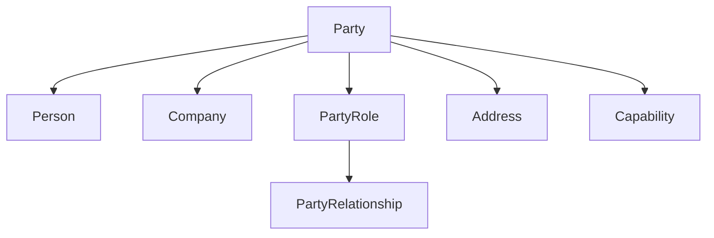

## Overview

The **Party** module implements the **Party pattern** for managing individuals, organizations, and their relationships. It supports:
- Persons and companies (organizations)
- Party roles and relationships
- Addresses (postal, geographic, email)
- Capabilities and requirements
- Temporal validity of relationships

## Core Concepts

### Party Hierarchy



### Party Types

<CodeGroup>
```java Person
public record Person(
    PartyId id,
    PersonName name,
    Optional<LocalDate> birthDate,
    PersonalIdentifiers identifiers
) implements Party {
    
    public record PersonName(
        String firstName,
        String lastName,
        Optional<String> middleName
    ) {
        public String fullName() {
            return firstName + " " + lastName;
        }
    }
}
```

```java Company
public record Company(
    PartyId id,
    CompanyName name,
    TaxIdentifier taxId,
    Optional<RegistrationNumber> registrationNumber
) implements Party {
    
    public record CompanyName(String legalName) {
        public static CompanyName of(String name) {
            return new CompanyName(name);
        }
    }
}
```
</CodeGroup>

## Party Roles

Parties play different roles in various contexts:

```java PartyRole
record PartyRole(
    PartyId partyId,
    RoleName role
) {
    public static PartyRole of(PartyId partyId, String roleName) {
        return new PartyRole(partyId, RoleName.of(roleName));
    }
}

// Common roles
PartyRole customer = PartyRole.of(partyId, "CUSTOMER");
PartyRole supplier = PartyRole.of(partyId, "SUPPLIER");
PartyRole employee = PartyRole.of(partyId, "EMPLOYEE");
PartyRole manager = PartyRole.of(partyId, "MANAGER");
```

## Party Relationships

Relationships connect parties in specific roles:

```java PartyRelationship
record PartyRelationship(
    PartyRelationshipId id,
    PartyRole from,
    PartyRole to,
    RelationshipName name,
    Validity validity
) {
    static PartyRelationship from(
        PartyRelationshipId id,
        PartyRole from,
        PartyRole to,
        RelationshipName name
    );
    
    static PartyRelationship from(
        PartyRelationshipId id,
        PartyRole from,
        PartyRole to,
        RelationshipName name,
        Validity validity
    );
}
```

### Creating Relationships

```java Relationship Examples
// Employment relationship
PartyRelationship employment = PartyRelationship.from(
    PartyRelationshipId.random(),
    PartyRole.of(employeeId, "EMPLOYEE"),
    PartyRole.of(companyId, "EMPLOYER"),
    RelationshipName.of("EMPLOYMENT"),
    Validity.between(
        LocalDateTime.of(2024, 1, 1, 0, 0),
        LocalDateTime.of(2025, 12, 31, 23, 59)
    )
);

// Customer-supplier relationship
PartyRelationship business = PartyRelationship.from(
    PartyRelationshipId.random(),
    PartyRole.of(customerId, "CUSTOMER"),
    PartyRole.of(supplierId, "SUPPLIER"),
    RelationshipName.of("BUSINESS_PARTNERSHIP")
);
```

### Managing Relationships

```java PartyRelationshipFacade
public class PartyRelationshipFacade {
    
    public Result<String, PartyRelationshipId> addRelationship(
        PartyRole from,
        PartyRole to,
        RelationshipName name,
        Validity validity
    );
    
    public List<PartyRelationship> findRelationshipsFor(
        PartyId partyId
    );
    
    public List<PartyRelationship> findRelationshipsBy(
        PartyRole role,
        RelationshipName name
    );
}
```

## Addresses

Multiple address types for different purposes:

### Address Types

<CodeGroup>
```java Postal Address
public record Address(
    AddressId id,
    AddressDetails details,
    AddressUseType useType,
    AddressLifecycle lifecycle
) {
    
    public record AddressDetails(
        String street,
        String city,
        String postalCode,
        String country,
        Optional<String> state,
        Optional<String> apartment
    ) {}
}

// Create address
Address homeAddress = new Address(
    AddressId.random(),
    new AddressDetails(
        "123 Main St",
        "Warsaw",
        "00-001",
        "Poland",
        Optional.empty(),
        Optional.of("Apt 4B")
    ),
    AddressUseType.HOME,
    AddressLifecycle.ACTIVE
);
```

```java Geographic Address
public record GeoAddress(
    AddressId id,
    double latitude,
    double longitude,
    Optional<String> locationName
) {
    
    public static GeoAddress of(
        double lat,
        double lon,
        String name
    ) {
        return new GeoAddress(
            AddressId.random(),
            lat,
            lon,
            Optional.of(name)
        );
    }
}

// Warehouse location
GeoAddress warehouse = GeoAddress.of(
    52.2297,
    21.0122,
    "Main Warehouse"
);
```

```java Email Address
public record EmailAddress(
    EmailAddressId id,
    EmailAddressDetails details,
    AddressLifecycle lifecycle
) {
    
    public record EmailAddressDetails(
        String email,
        EmailType type
    ) {}
    
    public enum EmailType {
        PERSONAL,
        WORK,
        OTHER
    }
}

// Work email
EmailAddress workEmail = new EmailAddress(
    EmailAddressId.random(),
    new EmailAddressDetails(
        "john.doe@company.com",
        EmailType.WORK
    ),
    AddressLifecycle.ACTIVE
);
```
</CodeGroup>

### Address Use Types

```java
public enum AddressUseType {
    HOME,           // Residential
    WORK,           // Business
    BILLING,        // Invoice address
    SHIPPING,       // Delivery address
    TEMPORARY,      // Temporary location
    CORRESPONDENCE  // Mailing address
}
```

### Address Lifecycle

```java
public enum AddressLifecycle {
    ACTIVE,         // Currently in use
    INACTIVE,       // Not in use
    DEPRECATED,     // Outdated but kept for history
    VERIFIED,       // Address verified
    UNVERIFIED      // Needs verification
}
```

### Address Management

```java AddressesFacade
public class AddressesFacade {
    
    public Result<String, AddressId> addAddress(
        PartyId partyId,
        Address address
    );
    
    public Result<String, Void> updateAddress(
        AddressId addressId,
        AddressDetails newDetails
    );
    
    public Result<String, Void> deactivateAddress(
        AddressId addressId
    );
    
    public List<AddressView> findAddressesFor(
        PartyId partyId,
        AddressUseType useType
    );
}
```

## Capabilities

Describe what parties can do:

```java Capability
public record Capability(
    CapabilityId id,
    CapabilityType type,
    String name,
    Optional<Validity> validity
) {
    
    public boolean isValidAt(LocalDateTime when) {
        return validity
            .map(v -> v.isValidAt(when))
            .orElse(true);
    }
}

// Capability types
public enum CapabilityType {
    SKILL,          // Individual skill
    CERTIFICATION,  // Official certification
    LICENSE,        // Legal license
    EQUIPMENT,      // Available equipment
    CAPACITY        // Resource capacity
}
```

### Capability Requirements

```java CapabilityRequirement
public record CapabilityRequirement(
    CapabilityType requiredType,
    String requiredName,
    int minimumLevel
) {
    
    public boolean isSatisfiedBy(Capability capability) {
        return capability.type() == requiredType
            && capability.name().equals(requiredName);
    }
}

// Example: Job requirements
List<CapabilityRequirement> jobRequirements = List.of(
    new CapabilityRequirement(
        CapabilityType.SKILL,
        "Java Programming",
        3
    ),
    new CapabilityRequirement(
        CapabilityType.CERTIFICATION,
        "AWS Certified",
        1
    )
);

// Check if party meets requirements
boolean qualified = jobRequirements.stream()
    .allMatch(req -> partyCapabilities.stream()
        .anyMatch(req::isSatisfiedBy));
```

### Managing Capabilities

```java CapabilitiesFacade
public class CapabilitiesFacade {
    
    public Result<String, CapabilityId> addCapability(
        PartyId partyId,
        Capability capability
    );
    
    public List<CapabilityView> findCapabilitiesFor(
        PartyId partyId,
        CapabilityType type
    );
    
    public List<PartyId> findPartiesWithCapability(
        CapabilityRequirement requirement
    );
}
```

## Address Defining Policy

Business rules for address management:

```java AddressDefiningPolicy
public interface AddressDefiningPolicy {
    
    Result<String, Void> validateAddress(Address address);
    
    boolean canAddAddressType(
        PartyId partyId,
        AddressUseType useType
    );
    
    default boolean allowsMultipleAddresses(
        AddressUseType useType
    ) {
        return useType != AddressUseType.BILLING;
    }
}

// Example policy
public class StandardAddressPolicy 
    implements AddressDefiningPolicy {
    
    @Override
    public Result<String, Void> validateAddress(Address address) {
        if (address.details().postalCode().isEmpty()) {
            return Result.failure("Postal code required");
        }
        return Result.success(null);
    }
}
```

## Real-World Example: Customer Onboarding

```java Complete Customer Setup
// Create person
Person customer = new Person(
    PartyId.random(),
    new Person.PersonName(
        "John",
        "Doe",
        Optional.of("Robert")
    ),
    Optional.of(LocalDate.of(1985, 5, 15)),
    PersonalIdentifiers.empty()
);

// Add home address
Address homeAddress = new Address(
    AddressId.random(),
    new AddressDetails(
        "456 Oak Avenue",
        "Krakow",
        "30-001",
        "Poland",
        Optional.empty(),
        Optional.empty()
    ),
    AddressUseType.HOME,
    AddressLifecycle.ACTIVE
);

addressesFacade.addAddress(customer.id(), homeAddress);

// Add shipping address (different from home)
Address shippingAddress = new Address(
    AddressId.random(),
    new AddressDetails(
        "100 Business Park",
        "Warsaw",
        "00-001",
        "Poland",
        Optional.empty(),
        Optional.of("Office 205")
    ),
    AddressUseType.SHIPPING,
    AddressLifecycle.ACTIVE
);

addressesFacade.addAddress(customer.id(), shippingAddress);

// Add email
EmailAddress email = new EmailAddress(
    EmailAddressId.random(),
    new EmailAddressDetails(
        "john.doe@email.com",
        EmailType.PERSONAL
    ),
    AddressLifecycle.VERIFIED
);

// Create customer role
PartyRole customerRole = PartyRole.of(
    customer.id(),
    "CUSTOMER"
);

// Establish relationship with company
PartyRelationship relationship = 
    PartyRelationship.from(
        PartyRelationshipId.random(),
        customerRole,
        PartyRole.of(companyId, "MERCHANT"),
        RelationshipName.of("CUSTOMER_OF")
    );

partyRelationshipFacade.addRelationship(relationship);
```

## Party Events

Domain events for party operations:

```java Events
public sealed interface PartyEvent extends PublishedEvent {
    // ...
}

record PartyRelationshipAdded(
    String relationshipId,
    String fromPartyId,
    String fromRole,
    String toPartyId,
    String toRole,
    String relationshipName
) implements PartyEvent {}
```

## Best Practices

<CardGroup cols={2}>
  <Card title="Use Roles" icon="user-tag">
    Model party behavior through roles, not types
  </Card>
  
  <Card title="Temporal Relationships" icon="clock">
    Always define validity for time-bound relationships
  </Card>
  
  <Card title="Multiple Addresses" icon="location-dot">
    Support multiple addresses per party
  </Card>
  
  <Card title="Verify Addresses" icon="check">
    Track address verification status
  </Card>
</CardGroup>

## Related Modules

- Uses [Common](/modules/common) for Result and events
- Used by [Ordering](/modules/ordering) for order parties
- Can be integrated with [Accounting](/modules/accounting) for accounts payable/receivable
