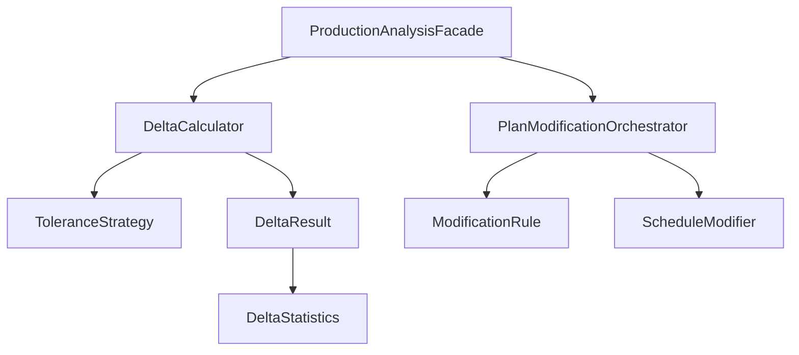

## Overview

The **Plan vs Execution** module provides tools for:
- Comparing planned production to actual results
- Calculating deltas with tolerance strategies
- Analyzing variance statistics
- Automated plan modifications based on rules
- Production matching algorithms

## Architecture



## Core Concepts

### Production Plans

```java ProductionPlan
public interface ProductionPlan {
    List<PlannedProduction> planned();
}

public record PlannedProduction(
    String productId,
    LocalDate date,
    int quantity,
    String productionLine
) {
    public static PlannedProduction of(
        String productId,
        LocalDate date,
        int quantity
    ) {
        return new PlannedProduction(
            productId,
            date,
            quantity,
            "default"
        );
    }
}

public record ActualProduction(
    String productId,
    LocalDate date,
    int quantity,
    String productionLine
) {}
```

### Configurable Production Plan

```java ConfigurableProductionPlan
public class ConfigurableProductionPlan 
    implements ProductionPlan {
    
    private List<PlannedProduction> planned;
    
    public ConfigurableProductionPlan(
        List<PlannedProduction> planned
    ) {
        this.planned = new ArrayList<>(planned);
    }
    
    public void updateQuantity(
        String productId,
        LocalDate date,
        int newQuantity
    ) {
        planned = planned.stream()
            .map(p -> {
                if (p.productId().equals(productId) 
                    && p.date().equals(date)) {
                    return new PlannedProduction(
                        p.productId(),
                        p.date(),
                        newQuantity,
                        p.productionLine()
                    );
                }
                return p;
            })
            .toList();
    }
    
    public void addBuffer(
        String productId,
        int bufferPercentage
    ) {
        planned = planned.stream()
            .map(p -> {
                if (p.productId().equals(productId)) {
                    int buffered = (int) Math.ceil(
                        p.quantity() * (1 + bufferPercentage / 100.0)
                    );
                    return new PlannedProduction(
                        p.productId(),
                        p.date(),
                        buffered,
                        p.productionLine()
                    );
                }
                return p;
            })
            .toList();
    }
    
    @Override
    public List<PlannedProduction> planned() {
        return List.copyOf(planned);
    }
}
```

## ProductionAnalysisFacade

Main entry point for analysis:

```java Facade
public class ProductionAnalysisFacade {
    
    public DeltaResult analyze(
        ProductionPlan planned,
        List<ActualProduction> actual,
        ToleranceStrategy tolerance
    ) {
        DeltaCalculator calculator = 
            new DeltaCalculator(tolerance);
        return calculator.calculate(planned, actual);
    }
}
```

## Delta Calculation

### Delta Calculator

```java DeltaCalculator
public class DeltaCalculator {
    private final ToleranceStrategy tolerance;
    
    public DeltaCalculator(ToleranceStrategy tolerance) {
        this.tolerance = tolerance;
    }
    
    public DeltaResult calculate(
        ProductionPlan plan,
        List<ActualProduction> actual
    ) {
        List<ProductionMatch> matches = 
            matchProductions(plan.planned(), actual);
        
        List<ProductionMatch> overproduction = 
            new ArrayList<>();
        List<ProductionMatch> underproduction = 
            new ArrayList<>();
        List<ProductionMatch> withinTolerance = 
            new ArrayList<>();
        
        for (ProductionMatch match : matches) {
            MatchResult result = 
                tolerance.evaluate(match);
            
            switch (result) {
                case OVER -> overproduction.add(match);
                case UNDER -> underproduction.add(match);
                case WITHIN -> withinTolerance.add(match);
            }
        }
        
        DeltaStatistics stats = 
            calculateStatistics(matches);
        
        return new DeltaResult(
            matches,
            overproduction,
            underproduction,
            withinTolerance,
            stats
        );
    }
    
    private List<ProductionMatch> matchProductions(
        List<PlannedProduction> planned,
        List<ActualProduction> actual
    ) {
        Map<String, Map<LocalDate, PlannedProduction>> 
            plannedMap = planned.stream()
                .collect(Collectors.groupingBy(
                    PlannedProduction::productId,
                    Collectors.toMap(
                        PlannedProduction::date,
                        p -> p
                    )
                ));
        
        return actual.stream()
            .map(a -> {
                PlannedProduction p = plannedMap
                    .getOrDefault(a.productId(), Map.of())
                    .get(a.date());
                
                if (p == null) {
                    return new ProductionMatch(
                        a.productId(),
                        a.date(),
                        0,  // Not planned
                        a.quantity()
                    );
                }
                
                return new ProductionMatch(
                    a.productId(),
                    a.date(),
                    p.quantity(),
                    a.quantity()
                );
            })
            .toList();
    }
}

// Match record
public record ProductionMatch(
    String productId,
    LocalDate date,
    int planned,
    int actual
) {
    public int delta() {
        return actual - planned;
    }
    
    public double variance() {
        if (planned == 0) return 0;
        return ((double) delta() / planned) * 100;
    }
}
```

### Delta Result

```java DeltaResult
public record DeltaResult(
    List<ProductionMatch> allMatches,
    List<ProductionMatch> overproduction,
    List<ProductionMatch> underproduction,
    List<ProductionMatch> withinTolerance,
    DeltaStatistics statistics
) {
    public boolean hasIssues() {
        return !overproduction.isEmpty() 
            || !underproduction.isEmpty();
    }
    
    public List<ProductionMatch> significantVariances() {
        return allMatches.stream()
            .filter(m -> Math.abs(m.variance()) > 10)
            .toList();
    }
}
```

### Delta Statistics

```java DeltaStatistics
public record DeltaStatistics(
    int totalPlanned,
    int totalActual,
    double averageVariance,
    double maxVariance,
    double minVariance,
    int matchesWithinTolerance,
    int totalMatches
) {
    public double accuracyPercentage() {
        if (totalMatches == 0) return 0;
        return (double) matchesWithinTolerance 
            / totalMatches * 100;
    }
    
    public int totalDelta() {
        return totalActual - totalPlanned;
    }
}
```

## Tolerance Strategies

Define acceptable variance:

<CodeGroup>
```java Exact Match
public class ExactMatch implements ToleranceStrategy {
    
    @Override
    public MatchResult evaluate(ProductionMatch match) {
        int delta = match.delta();
        
        if (delta == 0) {
            return MatchResult.WITHIN;
        } else if (delta > 0) {
            return MatchResult.OVER;
        } else {
            return MatchResult.UNDER;
        }
    }
}
```

```java Percentage Tolerance
public class PercentageTolerance 
    implements ToleranceStrategy {
    
    private final double tolerancePercentage;
    
    public PercentageTolerance(double percentage) {
        this.tolerancePercentage = percentage;
    }
    
    @Override
    public MatchResult evaluate(ProductionMatch match) {
        double variance = Math.abs(match.variance());
        
        if (variance <= tolerancePercentage) {
            return MatchResult.WITHIN;
        }
        
        return match.delta() > 0 
            ? MatchResult.OVER 
            : MatchResult.UNDER;
    }
}
```

```java Combined Tolerance
public class CombinedTolerance 
    implements ToleranceStrategy {
    
    private final int absoluteTolerance;
    private final double percentageTolerance;
    
    @Override
    public MatchResult evaluate(ProductionMatch match) {
        int delta = Math.abs(match.delta());
        double variance = Math.abs(match.variance());
        
        if (delta <= absoluteTolerance 
            || variance <= percentageTolerance) {
            return MatchResult.WITHIN;
        }
        
        return match.delta() > 0 
            ? MatchResult.OVER 
            : MatchResult.UNDER;
    }
}
```
</CodeGroup>

```java Match Result
public enum MatchResult {
    WITHIN,     // Within tolerance
    OVER,       // Overproduction
    UNDER       // Underproduction
}

public interface ToleranceStrategy {
    MatchResult evaluate(ProductionMatch match);
}
```

## Plan Modification

### Modification Orchestrator

```java PlanModificationOrchestrator
public class PlanModificationOrchestrator {
    
    private final List<ModificationRule> rules;
    
    public ConfigurableProductionPlan modify(
        ConfigurableProductionPlan plan,
        DeltaResult deltaResult
    ) {
        ConfigurableProductionPlan modified = plan;
        
        for (ModificationRule rule : rules) {
            if (rule.shouldApply(deltaResult)) {
                modified = rule.apply(modified, deltaResult);
            }
        }
        
        return modified;
    }
}
```

### Modification Rules

```java ModificationRule
public interface ModificationRule {
    
    boolean shouldApply(DeltaResult deltaResult);
    
    ConfigurableProductionPlan apply(
        ConfigurableProductionPlan plan,
        DeltaResult deltaResult
    );
}

// Condition interface
public interface ScheduleModificationCondition {
    boolean isMet(DeltaResult deltaResult);
}

// Modifier interface
public interface ScheduleModifier {
    ConfigurableProductionPlan modify(
        ConfigurableProductionPlan plan,
        DeltaResult deltaResult
    );
}
```

### Under-Production Rule

```java UnderProductionCondition
public class UnderProductionCondition 
    implements ScheduleModificationCondition {
    
    private final double threshold;
    
    public UnderProductionCondition(double threshold) {
        this.threshold = threshold;
    }
    
    @Override
    public boolean isMet(DeltaResult deltaResult) {
        return !deltaResult.underproduction().isEmpty()
            && deltaResult.statistics().averageVariance() 
                < -threshold;
    }
}
```

### Increase Buffer Modifier

```java IncreaseBufferModifier
public class IncreaseBufferModifier 
    implements ScheduleModifier {
    
    private final int bufferPercentage;
    
    public IncreaseBufferModifier(int percentage) {
        this.bufferPercentage = percentage;
    }
    
    @Override
    public ConfigurableProductionPlan modify(
        ConfigurableProductionPlan plan,
        DeltaResult deltaResult
    ) {
        ConfigurableProductionPlan modified = plan;
        
        // Add buffer to underperforming products
        Set<String> underProducts = deltaResult
            .underproduction()
            .stream()
            .map(ProductionMatch::productId)
            .collect(Collectors.toSet());
        
        for (String productId : underProducts) {
            modified.addBuffer(productId, bufferPercentage);
        }
        
        return modified;
    }
}
```

## Real-World Example: Manufacturing Analysis

```java Complete Analysis
// 1. Define plan
ConfigurableProductionPlan plan = 
    new ConfigurableProductionPlan(List.of(
        PlannedProduction.of("WIDGET-A", 
            LocalDate.of(2024, 3, 15), 1000),
        PlannedProduction.of("WIDGET-B", 
            LocalDate.of(2024, 3, 15), 500),
        PlannedProduction.of("WIDGET-A", 
            LocalDate.of(2024, 3, 16), 1000)
    ));

// 2. Record actual production
List<ActualProduction> actual = List.of(
    new ActualProduction("WIDGET-A", 
        LocalDate.of(2024, 3, 15), 850, "LINE-1"),
    new ActualProduction("WIDGET-B", 
        LocalDate.of(2024, 3, 15), 520, "LINE-2"),
    new ActualProduction("WIDGET-A", 
        LocalDate.of(2024, 3, 16), 900, "LINE-1")
);

// 3. Analyze with tolerance
ToleranceStrategy tolerance = 
    new PercentageTolerance(5.0);  // ±5%

DeltaResult result = facade.analyze(
    plan,
    actual,
    tolerance
);

// 4. Review results
System.out.println("Statistics:");
System.out.println("  Total Planned: " + 
    result.statistics().totalPlanned());
System.out.println("  Total Actual: " + 
    result.statistics().totalActual());
System.out.println("  Average Variance: " + 
    String.format("%.2f%%", 
        result.statistics().averageVariance()));
System.out.println("  Accuracy: " + 
    String.format("%.2f%%", 
        result.statistics().accuracyPercentage()));

System.out.println("\nUnderproduction:");
for (ProductionMatch match : result.underproduction()) {
    System.out.println("  " + match.productId() + 
        " on " + match.date() + 
        ": " + match.planned() + 
        " planned, " + match.actual() + 
        " actual (" + 
        String.format("%.2f%%", match.variance()) + 
        ")");
}

// 5. Automatic plan adjustment
if (result.hasIssues()) {
    ModificationRule rule = new ModificationRule() {
        @Override
        public boolean shouldApply(DeltaResult delta) {
            return new UnderProductionCondition(5.0)
                .isMet(delta);
        }
        
        @Override
        public ConfigurableProductionPlan apply(
            ConfigurableProductionPlan p,
            DeltaResult delta
        ) {
            return new IncreaseBufferModifier(10)
                .modify(p, delta);
        }
    };
    
    PlanModificationOrchestrator orchestrator = 
        new PlanModificationOrchestrator(List.of(rule));
    
    ConfigurableProductionPlan adjusted = 
        orchestrator.modify(plan, result);
    
    System.out.println("\nAdjusted plan:");
    for (PlannedProduction p : adjusted.planned()) {
        System.out.println("  " + p.productId() + 
            " on " + p.date() + 
            ": " + p.quantity());
    }
}

// Output:
// Statistics:
//   Total Planned: 2500
//   Total Actual: 2270
//   Average Variance: -9.20%
//   Accuracy: 33.33%
//
// Underproduction:
//   WIDGET-A on 2024-03-15: 1000 planned, 850 actual (-15.00%)
//   WIDGET-A on 2024-03-16: 1000 planned, 900 actual (-10.00%)
//
// Adjusted plan:
//   WIDGET-A on 2024-03-15: 1100  (10% buffer added)
//   WIDGET-B on 2024-03-15: 500
//   WIDGET-A on 2024-03-16: 1100  (10% buffer added)
```

## Bad Implementation Example

The module includes a "bad implementation" example for learning:

```java deliveryscheduling/
// This package demonstrates anti-patterns:
- Tight coupling
- Missing abstractions
- Hard-coded business logic
- Difficult to test

// Use as reference for what NOT to do
```

## Best Practices

<CardGroup cols={2}>
  <Card title="Define Tolerance" icon="sliders">
    Always specify acceptable variance thresholds
  </Card>
  
  <Card title="Track Statistics" icon="chart-simple">
    Monitor trends over time, not just point-in-time
  </Card>
  
  <Card title="Automate Carefully" icon="robot">
    Review automated adjustments before applying
  </Card>
  
  <Card title="Match Precisely" icon="bullseye">
    Ensure correct matching of planned vs actual
  </Card>
</CardGroup>

## Related Modules

- Uses [Common](/modules/common) for Result pattern
- Can integrate with [Inventory](/modules/inventory) for stock planning
- Can integrate with [Ordering](/modules/ordering) for demand forecasting
