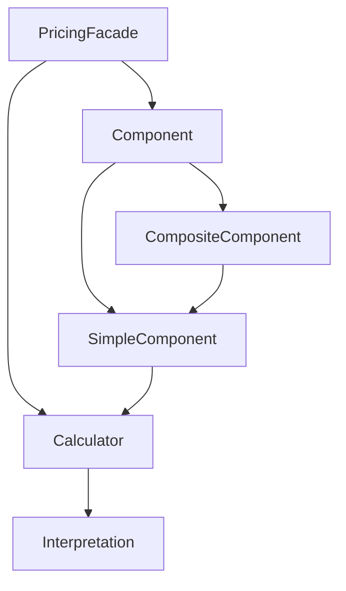

## Overview

The **Pricing** module provides a sophisticated pricing engine that supports:
- Multiple calculator types (fixed, step functions, time-based, etc.)
- Pricing components with versioning
- Composite pricing structures
- Applicability constraints and validity periods
- Price interpretations (total, unit, marginal)

## Architecture



## Calculator Types

### Simple Fixed Calculator

Returns a constant price:

```java
Calculator calculator = pricingFacade.addCalculator(
    "basic-fee",
    CalculatorType.SIMPLE_FIXED,
    Parameters.of(Map.of(
        "amount", Money.pln(100),
        "interpretation", Interpretation.TOTAL
    ))
);

Money price = calculator.calculate(Parameters.empty());
// Result: 100 PLN
```

### Step Function Calculator

Price changes at quantity thresholds:

```java Step Function
Calculator stepCalc = pricingFacade.addCalculator(
    "volume-pricing",
    CalculatorType.STEP_FUNCTION,
    Parameters.of(Map.of(
        "basePrice", Money.pln(10),
        "stepSize", new BigDecimal("100"),
        "stepIncrement", new BigDecimal("1"),
        "interpretation", Interpretation.UNIT,
        "stepBoundary", StepBoundary.LOWER
    ))
);

// Calculate for 150 units
Money unitPrice = stepCalc.calculate(
    Parameters.of(Map.of("quantity", new BigDecimal("150")))
);
// Result: 11 PLN per unit (10 + 1 for passing 100 threshold)
```

<Note>
  **Step Boundaries:**
  - `LOWER`: Price changes when quantity ≥ threshold
  - `UPPER`: Price changes when quantity > threshold
</Note>

### Discrete Points Calculator

Price from lookup table:

```java
Map<BigDecimal, Money> points = Map.of(
    new BigDecimal("1"), Money.pln(100),
    new BigDecimal("10"), Money.pln(90),
    new BigDecimal("50"), Money.pln(80),
    new BigDecimal("100"), Money.pln(70)
);

Calculator discrete = pricingFacade.addCalculator(
    "tier-pricing",
    CalculatorType.DISCRETE_POINTS,
    Parameters.of(Map.of(
        "points", points,
        "interpretation", Interpretation.UNIT
    ))
);

Money price = discrete.calculate(
    Parameters.of(Map.of("quantity", new BigDecimal("25")))
);
// Interpolates between points
```

### Time-Based Calculators

<CodeGroup>
```java Daily Increment
Calculator dailyCalc = pricingFacade.addCalculator(
    "parking-daily",
    CalculatorType.DAILY_INCREMENT,
    Parameters.of(Map.of(
        "startDate", LocalDate.of(2024, 1, 1),
        "startPrice", Money.pln(20),
        "dailyIncrement", Money.pln(5),
        "interpretation", Interpretation.TOTAL
    ))
);

Money price = dailyCalc.calculate(
    Parameters.of(Map.of("date", LocalDate.of(2024, 1, 5)))
);
// Result: 20 + (4 * 5) = 40 PLN
```

```java Continuous Linear Time
Calculator continuousCalc = pricingFacade.addCalculator(
    "hourly-rate",
    CalculatorType.CONTINUOUS_LINEAR_TIME,
    Parameters.of(Map.of(
        "startTime", LocalTime.of(8, 0),
        "startPrice", Money.pln(50),
        "endTime", LocalTime.of(18, 0),
        "endPrice", Money.pln(100),
        "interpretation", Interpretation.TOTAL
    ))
);

Money price = continuousCalc.calculate(
    Parameters.of(Map.of("time", LocalTime.of(13, 0)))
);
// Linear interpolation between start and end
```
</CodeGroup>

### Composite Calculator

Select calculator based on ranges:

```java Composite
List<CalculatorRange> ranges = List.of(
    new CalculatorRange(
        Range.of(BigDecimal.ZERO, new BigDecimal("10")),
        "small-quantity-calc"
    ),
    new CalculatorRange(
        Range.of(new BigDecimal("10"), new BigDecimal("100")),
        "medium-quantity-calc"
    ),
    new CalculatorRange(
        Range.of(new BigDecimal("100"), null),
        "large-quantity-calc"
    )
);

Calculator composite = pricingFacade.addCalculator(
    "quantity-based",
    CalculatorType.COMPOSITE,
    Parameters.of(Map.of(
        "ranges", ranges,
        "rangeSelector", "quantity"
    ))
);

Money price = composite.calculate(
    Parameters.of(Map.of("quantity", new BigDecimal("50")))
);
// Uses "medium-quantity-calc"
```

### Percentage Calculator

```java
Calculator percentage = pricingFacade.addCalculator(
    "discount-10pct",
    CalculatorType.PERCENTAGE,
    Parameters.of(Map.of(
        "percentageRate", new BigDecimal("10")
    ))
);

Money discount = percentage.calculate(
    Parameters.of(Map.of("baseAmount", Money.pln(1000)))
);
// Result: 100 PLN (10% of 1000)
```

## Price Interpretations

The module supports three price interpretations:

```java Interpretation Types
public enum Interpretation {
    TOTAL,     // Total price for entire quantity
    UNIT,      // Price per unit (average)
    MARGINAL   // Price for next unit
}
```

### Automatic Conversion

The facade automatically converts between interpretations:

```java Auto-conversion
// Calculator returns UNIT price
Calculator unitCalc = /* returns unit price */;

// Automatically convert to TOTAL
Money total = pricingFacade.calculateTotal(
    "calculator-name",
    Parameters.of(Map.of("quantity", new BigDecimal("10")))
);
// Multiplies unit price by quantity

// Automatically convert to MARGINAL
Money marginal = pricingFacade.calculateMarginal(
    "calculator-name",
    parameters
);
// Calculates: total(n) - total(n-1)
```

## Components

Components add versioning and business rules on top of calculators.

### Simple Component

Wraps a single calculator with applicability and validity:

```java Simple Component
SimpleComponent component = pricingFacade.createSimpleComponent(
    "standard-shipping",
    "shipping-calculator",
    Map.of("weight", "orderWeight"),  // Parameter mapping
    ApplicabilityConstraint.alwaysTrue(),
    Validity.from(LocalDateTime.now())
);

Money price = component.calculate(
    Parameters.of(Map.of("orderWeight", new BigDecimal("5")))
);
```

**Parameter Mapping:**
```java
// Maps external parameter names to calculator parameter names
Map<String, String> mappings = Map.of(
    "orderTotal", "baseAmount",    // orderTotal → baseAmount
    "customerTier", "tier"          // customerTier → tier
);
```

### Composite Component

Combines multiple components:

```java Composite Component
CompositeComponent orderPricing = pricingFacade.createCompositeComponent(
    "full-order-price",
    Map.of(),  // Dependencies between child components
    "product-price",
    "shipping-fee",
    "handling-fee",
    "tax"
);

// Calculates sum of all child components
Money totalPrice = orderPricing.calculate(parameters);

// Get breakdown
ComponentBreakdown breakdown = 
    pricingFacade.calculateComponentBreakdown(
        "full-order-price",
        parameters
    );

for (ComponentBreakdown.Item item : breakdown.items()) {
    System.out.println(item.name() + ": " + item.amount());
}
```

### Component Dependencies

Pass calculated values between components:

```java Dependencies
Map<String, Map<String, ParameterValue>> dependencies = Map.of(
    "tax",  // Component name
    Map.of(
        "taxableAmount",  // Parameter name
        ParameterValue.fromComponent("product-price")  // Use result from another component
    )
);

CompositeComponent withDeps = pricingFacade.createCompositeComponent(
    "order-with-tax",
    dependencies,
    "product-price",
    "tax"
);
```

### Component Versioning

Components support versioning for price changes over time:

```java Versioning
// Create initial version
SimpleComponent v1 = pricingFacade.createSimpleComponent(
    "premium-membership",
    "fixed-calc-old",
    Map.of(),
    ApplicabilityConstraint.alwaysTrue(),
    Validity.from(LocalDateTime.of(2024, 1, 1, 0, 0))
);

// Update creates new version
SimpleComponent v2 = pricingFacade.createSimpleComponent(
    "premium-membership",  // Same name
    "fixed-calc-new",
    Map.of(),
    ApplicabilityConstraint.alwaysTrue(),
    Validity.from(LocalDateTime.of(2024, 7, 1, 0, 0))
);

// Component automatically selects correct version based on validity
```

## Applicability Constraints

Control when pricing applies:

```java Constraints
// Custom constraint
ApplicabilityConstraint premiumOnly = context -> {
    String tier = context.get("customerTier");
    return "PREMIUM".equals(tier);
};

SimpleComponent premiumPrice = pricingFacade.createSimpleComponent(
    "premium-shipping",
    "express-calc",
    Map.of(),
    premiumOnly
);

// Check applicability
PricingContext context = new PricingContext(
    Map.of("customerTier", "PREMIUM")
);

if (premiumPrice.isApplicable(context)) {
    Money price = premiumPrice.calculate(parameters);
}
```

## Validity Periods

```java Validity
// From specific date
Validity from = Validity.from(LocalDateTime.of(2024, 1, 1, 0, 0));

// Between dates
Validity between = Validity.between(
    LocalDateTime.of(2024, 1, 1, 0, 0),
    LocalDateTime.of(2024, 12, 31, 23, 59)
);

// Always valid
Validity always = Validity.always();

// Check validity
if (validity.isValidAt(LocalDateTime.now())) {
    // Use pricing
}
```

## Real-World Example: Bank Account Fees

From test scenarios:

```java Bank Account Pricing
// Base account fee
Calculator baseFee = pricingFacade.addCalculator(
    "base-monthly-fee",
    CalculatorType.SIMPLE_FIXED,
    Parameters.of(Map.of("amount", Money.pln(10)))
);

// Transaction fee (per transaction)
Calculator transactionFee = pricingFacade.addCalculator(
    "transaction-fee",
    CalculatorType.STEP_FUNCTION,
    Parameters.of(Map.of(
        "basePrice", Money.pln(1),
        "stepSize", new BigDecimal("10"),
        "stepIncrement", new BigDecimal("-0.1")
    ))
);

// Overdraft interest
Calculator overdraftInterest = pricingFacade.addCalculator(
    "overdraft-interest",
    CalculatorType.PERCENTAGE,
    Parameters.of(Map.of("percentageRate", new BigDecimal("15")))
);

// Combine into account pricing
CompositeComponent accountPricing = 
    pricingFacade.createCompositeComponent(
        "checking-account-fees",
        Map.of(),
        "base-monthly-fee",
        "transaction-fee",
        "overdraft-interest"
    );
```

## Best Practices

<CardGroup cols={2}>
  <Card title="Use Components" icon="layer-group">
    Wrap calculators in components for versioning and business rules
  </Card>
  
  <Card title="Set Validity" icon="calendar">
    Always define validity periods for price changes
  </Card>
  
  <Card title="Clear Interpretations" icon="magnifying-glass">
    Specify interpretation (TOTAL/UNIT/MARGINAL) explicitly
  </Card>
  
  <Card title="Test Boundaries" icon="chart-line">
    Test step functions at boundary values
  </Card>
</CardGroup>

## Configuration

```java
PricingConfiguration config = new PricingConfiguration();
PricingFacade pricingFacade = config.pricingFacade(clock);
```

## Related Modules

- Uses [Quantity](/modules/quantity) for Money
- Can be integrated with [Product](/modules/product) for product pricing
- Used by [Ordering](/modules/ordering) for order line pricing
