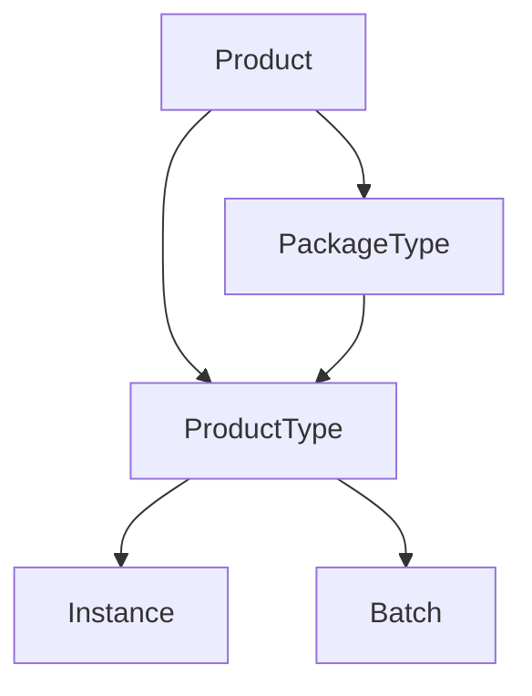

## Overview

The **Product** module implements a comprehensive product catalog system supporting:
- Product types (simple products)
- Package types (composite products)
- Product instances (serialized, batched)
- Product identifiers (GTIN, ISBN, IMEI)
- Feature-based product definitions
- Applicability constraints

## Core Concepts

### Product Hierarchy



The module uses the **Composite Pattern**:
- `Product` - Component interface
- `ProductType` - Leaf (individual product)
- `PackageType` - Composite (package of products)

### Product Interface

```java Product
interface Product {
    ProductIdentifier id();
    ProductName name();
    ProductDescription description();
    ProductMetadata metadata();
    ApplicabilityConstraint applicabilityConstraint();
    
    default boolean isApplicableFor(ApplicabilityContext context) {
        return applicabilityConstraint().isSatisfiedBy(context);
    }
}
```

## Product Identifiers

Supports various product identification standards:

<CodeGroup>
```java GTIN (Global Trade Item Number)
public record GtinProductIdentifier(
    String value,
    GtinType type  // GTIN-8, GTIN-12, GTIN-13, GTIN-14
) implements ProductIdentifier {
    
    public static GtinProductIdentifier gtin13(String value) {
        // Validates checksum
        return new GtinProductIdentifier(value, GtinType.GTIN_13);
    }
}

// Example
GtinProductIdentifier ean = 
    GtinProductIdentifier.gtin13("5901234123457");
```

```java ISBN (International Standard Book Number)
public record IsbnProductIdentifier(
    String value,
    IsbnType type  // ISBN-10, ISBN-13
) implements ProductIdentifier {
    
    public static IsbnProductIdentifier isbn13(String value) {
        return new IsbnProductIdentifier(value, IsbnType.ISBN_13);
    }
}

// Example
IsbnProductIdentifier bookId = 
    IsbnProductIdentifier.isbn13("978-3-16-148410-0");
```
</CodeGroup>

## Product Catalog

Central registry for product definitions:

```java ProductCatalog
public class ProductCatalog {
    private final CatalogEntryRepository repository;
    
    public Result<String, CatalogEntryId> register(
        Product product,
        ProductTrackingStrategy trackingStrategy
    );
    
    public Optional<CatalogEntry> find(ProductIdentifier productId);
    
    public List<CatalogEntry> findAll();
}
```

### Catalog Entry

```java
record CatalogEntry(
    CatalogEntryId id,
    Product product,
    ProductTrackingStrategy trackingStrategy,
    ProductFeatures features
) {
    // Product definition with tracking strategy
}
```

## Product Features

Define product characteristics with constraints:

```java Feature Definition
public class ProductFeatures {
    private final Map<String, FeatureDefinition> features;
    
    public void addFeature(
        String name,
        FeatureValueType type,
        FeatureValueConstraint constraint
    );
}

// Feature value types
public enum FeatureValueType {
    TEXT,
    NUMERIC,
    DECIMAL,
    DATE,
    BOOLEAN
}
```

### Feature Constraints

<AccordionGroup>
  <Accordion title="Allowed Values Constraint">
    ```java
    AllowedValuesConstraint colorConstraint = 
        AllowedValuesConstraint.of(
            Set.of("Red", "Blue", "Green", "Black")
        );
    
    features.addFeature(
        "color",
        FeatureValueType.TEXT,
        colorConstraint
    );
    ```
  </Accordion>

  <Accordion title="Numeric Range Constraint">
    ```java
    NumericRangeConstraint sizeConstraint = 
        NumericRangeConstraint.between(6, 12);
    
    features.addFeature(
        "shoeSize",
        FeatureValueType.NUMERIC,
        sizeConstraint
    );
    ```
  </Accordion>

  <Accordion title="Decimal Range Constraint">
    ```java
    DecimalRangeConstraint weightConstraint = 
        DecimalRangeConstraint.between(
            new BigDecimal("0.1"),
            new BigDecimal("100.0")
        );
    
    features.addFeature(
        "weight",
        FeatureValueType.DECIMAL,
        weightConstraint
    );
    ```
  </Accordion>

  <Accordion title="Date Range Constraint">
    ```java
    DateRangeConstraint expiryConstraint = 
        DateRangeConstraint.from(LocalDate.now());
    
    features.addFeature(
        "expiryDate",
        FeatureValueType.DATE,
        expiryConstraint
    );
    ```
  </Accordion>
</AccordionGroup>

## Product Instances

Physical or logical instances of products:

### Instance Types

```java Instance Hierarchy
sealed interface Instance permits ProductInstance, PackageInstance {
    InstanceId id();
    ProductIdentifier productId();
    Optional<SerialNumber> serialNumber();
    Optional<BatchId> batchId();
}

// Individual product instance
record ProductInstance(
    InstanceId id,
    ProductIdentifier productId,
    SerialNumber serialNumber,  // Unique identifier
    BatchId batchId,            // Production batch
    Quantity quantity,
    Map<String, Object> features
) implements Instance {}

// Package instance
record PackageInstance(
    InstanceId id,
    ProductIdentifier packageId,
    List<Instance> contents,
    PackageValidationResult validationResult
) implements Instance {}
```

### Building Instances

```java InstanceBuilder
ProductInstance instance = new InstanceBuilder(
        InstanceId.random(),
        productId
    )
    .withSerial(TextualSerialNumber.of("SN123456"))
    .withBatch(BatchId.of("BATCH-2024-001"))
    .withQuantity(Quantity.of(1, Unit.pieces()))
    .withFeatures(Map.of(
        "color", "Blue",
        "size", "Large"
    ))
    .build();
```

## Serial Numbers

Unique instance identifiers:

<CodeGroup>
```java Textual Serial Number
public record TextualSerialNumber(String value) 
    implements SerialNumber {
    
    public static TextualSerialNumber of(String value) {
        return new TextualSerialNumber(value);
    }
}

// Usage
SerialNumber serial = TextualSerialNumber.of("ABC-123-XYZ");
```

```java IMEI Serial Number
public record ImeiSerialNumber(String value) 
    implements SerialNumber {
    
    public static ImeiSerialNumber of(String imei) {
        // Validates IMEI checksum
        return new ImeiSerialNumber(imei);
    }
}

// Usage
SerialNumber imei = ImeiSerialNumber.of("352099001761481");
```
</CodeGroup>

## Batches

Group instances from same production run:

```java Batch
public record Batch(
    BatchId id,
    BatchName name,
    ProductIdentifier productId,
    LocalDate productionDate,
    Optional<LocalDate> expiryDate
) {
    public boolean isExpired(LocalDate asOf) {
        return expiryDate
            .map(expiry -> asOf.isAfter(expiry))
            .orElse(false);
    }
}

// Usage
Batch batch = new Batch(
    BatchId.of("BATCH-001"),
    BatchName.of("January Production"),
    productId,
    LocalDate.of(2024, 1, 15),
    Optional.of(LocalDate.of(2025, 1, 15))
);

boolean expired = batch.isExpired(LocalDate.now());
```

## Package Types

Composite products containing other products:

```java Package Structure
public class PackageStructure {
    private final Map<ProductIdentifier, PackageComponent> components;
    
    public record PackageComponent(
        ProductIdentifier productId,
        Quantity quantity,
        boolean required
    ) {}
    
    public PackageValidationResult validate(
        List<Instance> contents
    ) {
        // Validates package contents match structure
    }
}

// Example: Gift box
PackageStructure giftBox = new PackageStructure();
giftBox.addComponent(
    ProductIdentifier.of("PRODUCT-001"),
    Quantity.of(1, Unit.pieces()),
    true  // required
);
giftBox.addComponent(
    ProductIdentifier.of("PRODUCT-002"),
    Quantity.of(2, Unit.pieces()),
    false  // optional
);
```

### Package Validation

```java
PackageInstance pkg = new PackageInstance(
    InstanceId.random(),
    packageProductId,
    List.of(instance1, instance2),
    null
);

PackageValidationResult result = 
    packageStructure.validate(pkg.contents());

if (result.isValid()) {
    // Package is complete
} else {
    List<String> errors = result.errors();
    // Handle validation errors
}
```

## Product Building

Fluent API for product creation:

```java ProductBuilder
Product product = Product.builder(
        ProductIdentifier.of("PROD-001"),
        ProductName.of("Premium Widget"),
        ProductDescription.of("High-quality widget")
    )
    .withMetadata(ProductMetadata.of(Map.of(
        "category", "Electronics",
        "brand", "ACME"
    )))
    .withApplicability(context -> {
        // Custom business rules
        return context.get("region").equals("EU");
    })
    .build();
```

## Applicability Context

Determine product availability:

```java Applicability
public class ApplicabilityContext {
    private final Map<String, Object> context;
    
    public Object get(String key);
    public boolean has(String key);
}

// Example: Regional product
ApplicabilityConstraint euOnly = context -> 
    "EU".equals(context.get("region"));

Product product = /* ... */;
if (product.isApplicableFor(euContext)) {
    // Show product to EU customers
}
```

## Product Commands

Domain commands for product operations:

```java Commands
// Register new product
public record RegisterProductCommand(
    ProductIdentifier productId,
    String name,
    String description,
    ProductTrackingStrategy trackingStrategy,
    Map<String, FeatureDefinition> features
) {}

// Create instance
public record CreateInstanceCommand(
    ProductIdentifier productId,
    Optional<SerialNumber> serialNumber,
    Optional<BatchId> batchId,
    Map<String, Object> features
) {}
```

## Tracking Strategies

Define how products are tracked:

```java ProductTrackingStrategy
public enum ProductTrackingStrategy {
    NONE,           // No tracking (bulk items)
    BATCH,          // Track by batch
    SERIAL_NUMBER,  // Track individual items
    LOT             // Track by lot number
}
```

## Real-World Example: Electronics Store

```java Complete Product Setup
// Register smartphone product
Product smartphone = Product.builder(
        GtinProductIdentifier.gtin13("5901234567890"),
        ProductName.of("Smartphone X"),
        ProductDescription.of("Latest flagship smartphone")
    )
    .build();

ProductFeatures features = new ProductFeatures();
features.addFeature(
    "color",
    FeatureValueType.TEXT,
    AllowedValuesConstraint.of(Set.of("Black", "White", "Blue"))
);
features.addFeature(
    "storage",
    FeatureValueType.NUMERIC,
    AllowedValuesConstraint.of(Set.of(128, 256, 512))
);

CatalogEntry entry = productCatalog.register(
    smartphone,
    ProductTrackingStrategy.SERIAL_NUMBER
);

// Create instance with IMEI
ProductInstance instance = new InstanceBuilder(
        InstanceId.random(),
        smartphone.id()
    )
    .withSerial(ImeiSerialNumber.of("352099001761481"))
    .withFeatures(Map.of(
        "color", "Black",
        "storage", 256
    ))
    .build();
```

## Best Practices

<CardGroup cols={2}>
  <Card title="Use Standard IDs" icon="barcode">
    Use GTIN/ISBN/IMEI for real products
  </Card>
  
  <Card title="Define Features" icon="sliders">
    Always specify feature constraints
  </Card>
  
  <Card title="Track Appropriately" icon="location-dot">
    Choose tracking strategy based on business needs
  </Card>
  
  <Card title="Validate Packages" icon="box-open">
    Always validate package contents
  </Card>
</CardGroup>

## Configuration

```java
ProductConfiguration config = new ProductConfiguration();
ProductCatalog catalog = config.productCatalog();
```

## Related Modules

- Uses [Common](/modules/common) for Result pattern
- Uses [Quantity](/modules/quantity) for quantities
- Integrates with [Inventory](/modules/inventory) for stock tracking
- Used by [Ordering](/modules/ordering) for order lines
- Can use [Pricing](/modules/pricing) for product pricing
