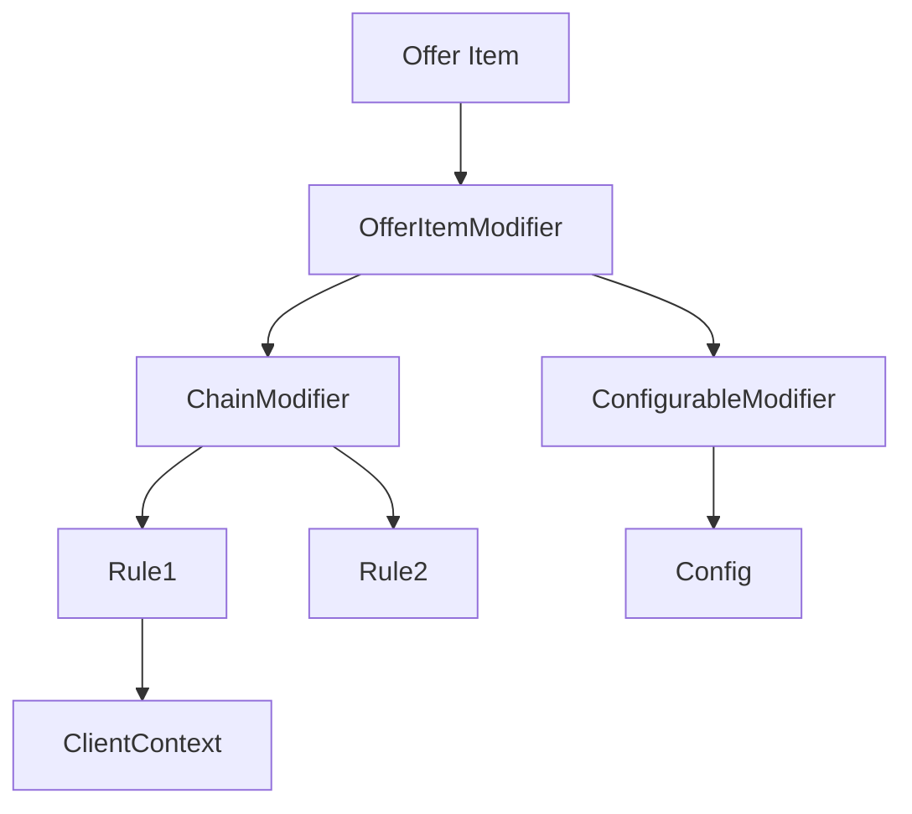

## Overview

The **Rules** module provides a flexible business rules engine focused on:
- Dynamic discounting rules
- Client status evaluation
- Configurable rule chains
- Visitor pattern for rule processing
- Reflection-based configuration

## Architecture



## Core Concepts

### Offer Item

Represents an item being priced:

```java OfferItem
public class OfferItem {
    private final String productId;
    private Money price;
    private final ClientContext clientContext;
    private final List<Modification> modifications;
    
    public OfferItem apply(Modification modification) {
        Money newPrice = modification.apply(this.price);
        List<Modification> newMods = 
            new ArrayList<>(modifications);
        newMods.add(modification);
        return new OfferItem(
            productId,
            newPrice,
            clientContext,
            newMods
        );
    }
    
    public Money finalPrice() {
        return price;
    }
}

// Price modification
public record Modification(
    String ruleName,
    Money originalPrice,
    Money newPrice,
    String reason
) {
    public Money apply(Money price) {
        return newPrice;
    }
}
```

### Offer Item Modifier

Base interface for all rule modifiers:

```java OfferItemModifier
public interface OfferItemModifier {
    OfferItem modify(OfferItem item);
}
```

## Modifier Types

### Chain Modifier

Executes multiple modifiers in sequence:

```java ChainOfferItemModifier
public class ChainOfferItemModifier 
    implements OfferItemModifier {
    
    private final List<OfferItemModifier> modifiers;
    
    public ChainOfferItemModifier(
        List<OfferItemModifier> modifiers
    ) {
        this.modifiers = List.copyOf(modifiers);
    }
    
    @Override
    public OfferItem modify(OfferItem item) {
        OfferItem result = item;
        for (OfferItemModifier modifier : modifiers) {
            result = modifier.modify(result);
        }
        return result;
    }
    
    public static ChainOfferItemModifier of(
        OfferItemModifier... modifiers
    ) {
        return new ChainOfferItemModifier(
            Arrays.asList(modifiers)
        );
    }
}
```

### Named Modifier

Modifier with a name for identification:

```java NamedOfferItemModifier
public record NamedOfferItemModifier(
    String name,
    OfferItemModifier modifier
) implements OfferItemModifier {
    
    @Override
    public OfferItem modify(OfferItem item) {
        return modifier.modify(item);
    }
}
```

### Configurable Modifier

Modifier driven by configuration:

```java ConfigurableItemModifier
public class ConfigurableItemModifier 
    implements OfferItemModifier {
    
    private final ConfigProvider configProvider;
    private final String configKey;
    
    @Override
    public OfferItem modify(OfferItem item) {
        Config config = configProvider.getConfig(configKey);
        
        // Apply discounts from config
        List<Discount> discounts = config.getDiscounts();
        OfferItem result = item;
        
        for (Discount discount : discounts) {
            if (discount.appliesTo(item)) {
                result = discount.apply(result);
            }
        }
        
        return result;
    }
}
```

### Empty Modifier

No-op modifier:

```java EmptyModifier
public class EmptyModifier implements OfferItemModifier {
    
    private static final EmptyModifier INSTANCE = 
        new EmptyModifier();
    
    public static EmptyModifier instance() {
        return INSTANCE;
    }
    
    @Override
    public OfferItem modify(OfferItem item) {
        return item;  // No modification
    }
}
```

## Client Context

Client information for rule evaluation:

```java ClientContext
public record ClientContext(
    String clientId,
    ClientStatus status,
    Money totalExpenses,
    LocalDate customerSince,
    Map<String, Object> additionalData
) {
    
    public boolean hasStatus(ClientStatus status) {
        return this.status == status;
    }
    
    public Duration timeAsCustomer() {
        return Duration.between(
            customerSince.atStartOfDay(),
            LocalDateTime.now()
        );
    }
}

public enum ClientStatus {
    NEW,
    REGULAR,
    VIP,
    PREMIUM,
    INACTIVE
}
```

### Client Finder

```java ClientFinder
public interface ClientFinder {
    Optional<ClientContext> findClient(String clientId);
}

// Repository
public interface ClientContextRepository {
    Optional<ClientContext> find(String clientId);
    void save(ClientContext context);
}
```

## Client Status Rules

Rules for determining client status:

```java StatusRule
public interface ClientStatusVisitor<T> {
    T visitNew();
    T visitRegular();
    T visitVip();
    T visitPremium();
}

// Status-based rule
public class StatusRule implements OfferItemModifier {
    
    private final Map<ClientStatus, OfferItemModifier> modifiers;
    
    @Override
    public OfferItem modify(OfferItem item) {
        ClientStatus status = 
            item.clientContext().status();
        
        OfferItemModifier modifier = modifiers.get(status);
        if (modifier == null) {
            return item;
        }
        
        return modifier.modify(item);
    }
}
```

### Expenses Rule

Discount based on total expenses:

```java ExpensesRule
public class ExpensesRule implements OfferItemModifier {
    
    private final List<ExpenseTier> tiers;
    
    public record ExpenseTier(
        Money minimumExpenses,
        Percentage discount
    ) {}
    
    @Override
    public OfferItem modify(OfferItem item) {
        Money totalExpenses = 
            item.clientContext().totalExpenses();
        
        ExpenseTier tier = tiers.stream()
            .filter(t -> totalExpenses
                .isGreaterThanOrEqualTo(t.minimumExpenses()))
            .max(Comparator.comparing(
                ExpenseTier::minimumExpenses))
            .orElse(null);
        
        if (tier == null) {
            return item;
        }
        
        Money discount = item.price()
            .multiply(tier.discount());
        Money newPrice = item.price().subtract(discount);
        
        return item.apply(new Modification(
            "expenses-discount",
            item.price(),
            newPrice,
            String.format("%.0f%% discount for %s expenses",
                tier.discount().value(),
                totalExpenses)
        ));
    }
}
```

### Time Being Customer Rule

Discount based on customer tenure:

```java TimeBeingCustomer
public class TimeBeingCustomer 
    implements OfferItemModifier {
    
    private final List<TenureTier> tiers;
    
    public record TenureTier(
        Duration minimumDuration,
        Percentage discount
    ) {}
    
    @Override
    public OfferItem modify(OfferItem item) {
        Duration tenure = 
            item.clientContext().timeAsCustomer();
        
        TenureTier tier = tiers.stream()
            .filter(t -> tenure.compareTo(
                t.minimumDuration()) >= 0)
            .max(Comparator.comparing(
                TenureTier::minimumDuration))
            .orElse(null);
        
        if (tier == null) {
            return item;
        }
        
        Money discount = item.price()
            .multiply(tier.discount());
        Money newPrice = item.price().subtract(discount);
        
        return item.apply(new Modification(
            "tenure-discount",
            item.price(),
            newPrice,
            String.format("%.0f%% loyalty discount (customer for %d years)",
                tier.discount().value(),
                tenure.toDays() / 365)
        ));
    }
}
```

## Discount Appliers

Different ways to apply discounts:

<CodeGroup>
```java Fixed Amount
public class Amount implements OfferItemModifier {
    private final Money discountAmount;
    
    @Override
    public OfferItem modify(OfferItem item) {
        Money newPrice = item.price()
            .subtract(discountAmount);
        
        return item.apply(new Modification(
            "fixed-amount",
            item.price(),
            Money.max(newPrice, Money.zeroPln()),
            "Fixed discount: " + discountAmount
        ));
    }
}
```

```java Fixed Price
public class FixedPrice implements OfferItemModifier {
    private final Money fixedPrice;
    
    @Override
    public OfferItem modify(OfferItem item) {
        return item.apply(new Modification(
            "fixed-price",
            item.price(),
            fixedPrice,
            "Special price: " + fixedPrice
        ));
    }
}
```

```java Percentage Accumulated
public class PercentageAccumulated 
    implements OfferItemModifier {
    
    private final Percentage discount;
    
    @Override
    public OfferItem modify(OfferItem item) {
        Money originalPrice = item.price();
        Money discountAmount = originalPrice
            .multiply(discount);
        Money newPrice = originalPrice
            .subtract(discountAmount);
        
        return item.apply(new Modification(
            "percentage-discount",
            originalPrice,
            newPrice,
            String.format("%.0f%% discount",
                discount.value())
        ));
    }
}
```
</CodeGroup>

## Dynamic Configuration

Reflection-based configuration:

```java Reflection Configuration
public class ReflectionDynamicConfig {
    
    private final Map<String, Discount> discounts;
    
    public void addDiscount(
        String name,
        String applierClass,
        Map<String, Object> parameters
    ) throws ReflectiveOperationException {
        // Load applier class
        Class<?> clazz = Class.forName(applierClass);
        
        // Create instance with parameters
        Object applier = createInstance(clazz, parameters);
        
        discounts.put(name, new Discount(
            name,
            (OfferItemModifier) applier
        ));
    }
    
    private Object createInstance(
        Class<?> clazz,
        Map<String, Object> params
    ) throws ReflectiveOperationException {
        // Find constructor and inject parameters
        // Implementation uses reflection
    }
}

@Discount(name = "vip-discount")
public class VipDiscount implements OfferItemModifier {
    
    @DiscountParam("percentage")
    private final BigDecimal percentage;
    
    // Reflection creates instance
}
```

## Modifier Factory

```java OfferItemModifierFactory
public class OfferItemModifierFactory {
    
    public OfferItemModifier createChain(
        ClientContext clientContext
    ) {
        List<OfferItemModifier> modifiers = 
            new ArrayList<>();
        
        // Add status-based discounts
        modifiers.add(createStatusModifier(clientContext));
        
        // Add expenses-based discounts
        modifiers.add(createExpensesModifier(clientContext));
        
        // Add tenure-based discounts
        modifiers.add(createTenureModifier(clientContext));
        
        return ChainOfferItemModifier.of(
            modifiers.toArray(new OfferItemModifier[0])
        );
    }
    
    private OfferItemModifier createStatusModifier(
        ClientContext context
    ) {
        return switch (context.status()) {
            case NEW -> EmptyModifier.instance();
            case REGULAR -> new PercentageAccumulated(
                Percentage.of(5)
            );
            case VIP -> new PercentageAccumulated(
                Percentage.of(10)
            );
            case PREMIUM -> new PercentageAccumulated(
                Percentage.of(15)
            );
            case INACTIVE -> EmptyModifier.instance();
        };
    }
}
```

## Visitor Pattern for Rules

```java Modifier Visitor
public interface OfferItemModifierVisitor<T> {
    T visitChain(ChainOfferItemModifier chain);
    T visitConfigurable(ConfigurableItemModifier configurable);
    T visitEmpty(EmptyModifier empty);
    T visitNamed(NamedOfferItemModifier named);
}

// Example: Rule explanation visitor
public class RuleExplanationVisitor 
    implements OfferItemModifierVisitor<String> {
    
    @Override
    public String visitChain(ChainOfferItemModifier chain) {
        return "Chain of rules: " + 
            chain.modifiers().stream()
                .map(m -> m.accept(this))
                .collect(Collectors.joining(" -> "));
    }
    
    @Override
    public String visitNamed(NamedOfferItemModifier named) {
        return named.name();
    }
}
```

## Real-World Example: E-commerce Discounting

```java Complete Discount Flow
// 1. Load client context
ClientContext client = clientFinder.findClient("CUST-123")
    .orElse(new ClientContext(
        "CUST-123",
        ClientStatus.NEW,
        Money.zeroPln(),
        LocalDate.now(),
        Map.of()
    ));

// 2. Create offer item
OfferItem item = new OfferItem(
    "PRODUCT-001",
    Money.pln(1000),
    client,
    List.of()
);

// 3. Build modifier chain
OfferItemModifier chain = ChainOfferItemModifier.of(
    // Status discount (10% for VIP)
    new StatusRule(Map.of(
        ClientStatus.VIP,
        new PercentageAccumulated(Percentage.of(10))
    )),
    
    // Expenses discount (5% for >10k PLN)
    new ExpensesRule(List.of(
        new ExpensesRule.ExpenseTier(
            Money.pln(10000),
            Percentage.of(5)
        )
    )),
    
    // Tenure discount (3% for 2+ years)
    new TimeBeingCustomer(List.of(
        new TimeBeingCustomer.TenureTier(
            Duration.ofDays(730),
            Percentage.of(3)
        )
    ))
);

// 4. Apply rules
OfferItem discounted = chain.modify(item);

// 5. Show result
System.out.println("Original: " + item.price());
System.out.println("Final: " + discounted.finalPrice());

for (Modification mod : discounted.modifications()) {
    System.out.println("  - " + mod.reason() + 
        ": " + mod.originalPrice() + 
        " -> " + mod.newPrice());
}

// Output:
// Original: 1000 PLN
// Final: 823.85 PLN
//   - 10% VIP discount: 1000 -> 900
//   - 5% expenses discount: 900 -> 855
//   - 3% loyalty discount: 855 -> 823.85
```

## Configuration Types

<CodeGroup>
```java Static Config
public class SampleStaticConfig {
    public static OfferItemModifier getModifier() {
        return ChainOfferItemModifier.of(
            new NamedOfferItemModifier(
                "early-bird",
                new PercentageAccumulated(
                    Percentage.of(15)
                )
            ),
            new NamedOfferItemModifier(
                "bulk-discount",
                new Amount(Money.pln(100))
            )
        );
    }
}
```

```java Dynamic Config
public class SampleDynamicConfig 
    implements ConfigProvider {
    
    private final DiscountRepository repository;
    
    @Override
    public Config getConfig(String key) {
        List<Discount> discounts = 
            repository.findByKey(key);
        return new Config(key, discounts);
    }
    
    public void updateConfig(
        String key,
        List<Discount> newDiscounts
    ) {
        repository.save(key, newDiscounts);
    }
}
```
</CodeGroup>

## Best Practices

<CardGroup cols={2}>
  <Card title="Chain Rules" icon="link">
    Combine multiple rules using ChainOfferItemModifier
  </Card>
  
  <Card title="Immutable Items" icon="lock">
    Always return new OfferItem, never modify in place
  </Card>
  
  <Card title="Track Changes" icon="list">
    Record all modifications for audit trail
  </Card>
  
  <Card title="Test Rules" icon="vial">
    Unit test each rule modifier independently
  </Card>
</CardGroup>

## Related Modules

- Uses [Quantity](/modules/quantity) for Money and Percentage
- Can integrate with [Party](/modules/party) for client context
- Can integrate with [Ordering](/modules/ordering) for order discounts
- Can integrate with [Pricing](/modules/pricing) for dynamic pricing
